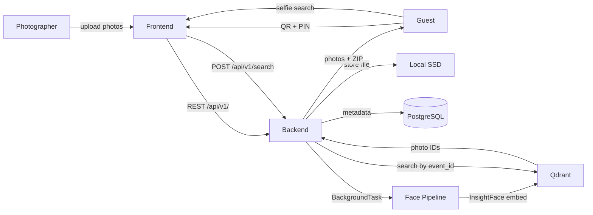

# CLAUDE.md

## Project Overview

**WeddingLens** — Private wedding photo-sharing platform where guests instantly find and download their own photos from thousands of wedding pictures using AI-powered face recognition.

Sub-projects:
| Name | Path | Stack | Purpose |
|------|------|-------|---------|
| backend | `backend/` | Python 3.12, FastAPI, PostgreSQL, Qdrant | REST API, face processing pipeline, photo management |
| frontend | `frontend/` | TypeScript, Next.js 14, Tailwind CSS | Guest gallery, face search UI, photographer dashboard |

---

## Architecture

WeddingLens is a per-event photo platform: a photographer uploads photos once, the backend indexes them (face detection + ArcFace embeddings into Qdrant), and guests find themselves by scanning a QR code, uploading a selfie, and downloading a ZIP. The entire system runs on a single 4-core/16GB VM with a local or USB SSD — no cloud storage, no user accounts. The FastAPI backend owns all data (PostgreSQL, Qdrant, local SSD) and runs face processing as in-process background tasks. The Next.js frontend handles the guest flow (QR+PIN → selfie → results → ZIP download) and the photographer dashboard. All face embeddings are encrypted at rest; searches are strictly isolated per `event_id`.



**Constraints (6 rules — enforced by `/build` and `/review`):**
1. Face processing is async — upload never blocks on it
2. Face embeddings encrypted at rest
3. Searches scoped per `event_id` — no cross-event leakage
4. Frontend calls backend only — never data stores directly
5. Backend owns all data stores exclusively
6. Face jobs are idempotent — restart-safe, no duplicate embeddings

**Full declaration:** [docs/architecture/system.md](docs/architecture/system.md)

---

## Key Files and Patterns

<!-- TODO: Populate once implementation begins. List main entry points, service layer, auth middleware. -->

---

## Data Model

Key stores:
- **PostgreSQL** — events, photos, guests, face records (metadata)
- **Qdrant** — face embedding vectors (512-dim, scoped per event_id)
- **Storage** — original and processed photo files

<!-- TODO: Expand with table schemas once data model is finalized. -->

---

## Authentication

- **Guests:** QR code-based event link + optional PIN set by the event owner. No account required.
- **Photographers / event owners:** TBD (email+password JWT or Google OAuth — not yet decided).
- See `docs/architecture/constraints.md` for the full auth contract.

---

## Commands

### backend
```bash
# Install dependencies
cd backend && python -m venv venv && source venv/bin/activate && pip install -r requirements.txt

# Dev server
uvicorn app.main:app --reload --port 8000

# Run tests
pytest -q

# Lint
ruff check .
```

### frontend
```bash
# Install dependencies
cd frontend && npm install

# Dev server
npm run dev

# Run tests
npm run test

# Build
npm run build

# Lint
npm run lint
```

---

## Environment Variables

| Variable | Used by | Notes |
|----------|---------|-------|
| `DATABASE_URL` | backend | PostgreSQL connection string |
| `QDRANT_URL` | backend | Qdrant server URL |
| `QDRANT_API_KEY` | backend | Qdrant API key (optional for local) |
| `STORAGE_PATH` | backend | Local disk path for photo storage |
| `SECRET_KEY` | backend | JWT signing secret |
| `NEXT_PUBLIC_API_URL` | frontend | Backend API base URL |

Copy `.env.example` → `.env` before running locally.

---

## Deployment

<!-- TODO: Cloud provider and deployment commands once decided. -->
<!-- Reference .claude/pai-orbit-config.md for deploy commands. -->

---

## Diagrams

Use **Mermaid** throughout — fenced ` ```mermaid ` blocks.
