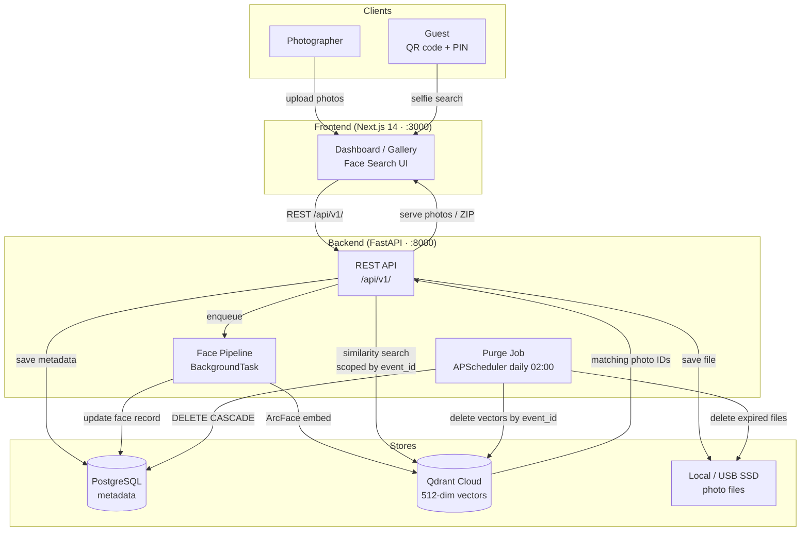

# WeddingLens

Private wedding photo-sharing platform where guests instantly find and download their own photos from thousands of wedding pictures using AI-powered face recognition.

A photographer uploads photos once. The backend indexes them with ArcFace embeddings stored in Qdrant. Guests scan a QR code, upload a selfie, and download a ZIP of every photo they appear in — no accounts required.

## Architecture



All services run on a single 4-core/16GB VM. Face embeddings are encrypted at rest. Searches are scoped per `event_id` — no cross-event leakage.

## Stack

| Layer | Tech |
|-------|------|
| Backend | Python 3.12, FastAPI, SQLAlchemy 2, Alembic |
| Database | PostgreSQL (metadata), Qdrant Cloud (vectors) |
| Storage | Local / USB SSD |
| Face ML | InsightFace / ArcFace (512-dim embeddings) |
| Frontend | TypeScript, Next.js 14, Tailwind CSS |
| Process mgr | PM2 |

## Getting Started

### Prerequisites

- Python 3.12+
- Node.js 18+
- PostgreSQL
- [Qdrant Cloud](https://cloud.qdrant.io) account (free tier works)

### Backend

```bash
cd backend
python -m venv venv && source venv/bin/activate
pip install -r requirements.txt

cp .env.example .env   # fill in DATABASE_URL, QDRANT_URL, QDRANT_API_KEY, SECRET_KEY

# Run migrations
alembic upgrade head

# Start dev server
uvicorn app.main:app --reload --port 8000
```

### Frontend

```bash
cd frontend
npm install

cp .env.example .env   # set NEXT_PUBLIC_API_URL=http://localhost:8000

npm run dev   # http://localhost:3000
```

### Production (PM2)

```bash
pm2 start ecosystem.config.js
```

## Environment Variables

| Variable | Service | Description |
|----------|---------|-------------|
| `DATABASE_URL` | backend | PostgreSQL connection string (`postgresql+asyncpg://...`) |
| `QDRANT_URL` | backend | Qdrant cluster URL |
| `QDRANT_API_KEY` | backend | Qdrant API key |
| `STORAGE_PATH` | backend | Absolute path for photo file storage |
| `SECRET_KEY` | backend | JWT signing secret (`openssl rand -hex 32`) |
| `FRONTEND_URL` | backend | Public frontend URL (used in QR code payloads) |
| `NEXT_PUBLIC_API_URL` | frontend | Backend API base URL |

## Development Commands

```bash
# Backend tests
cd backend && pytest -q

# Backend lint
cd backend && ruff check .

# Frontend lint
cd frontend && npm run lint

# Frontend build check
cd frontend && npm run build
```

## Project Structure

```
backend/
  app/
    routers/       # API route handlers
    services/      # Business logic
    models/        # SQLAlchemy ORM models
    schemas/       # Pydantic request/response schemas
  alembic/         # Database migrations
  tests/

frontend/
  app/             # Next.js App Router pages
  components/      # Shared UI components
  lib/             # API client, auth helpers
  types/           # TypeScript type definitions

docs/
  architecture/    # System design and constraints
  decisions/       # Architectural Decision Records (ADRs)
  epics/           # Feature epics and planning
```

## License

See [LICENSE](LICENSE).
