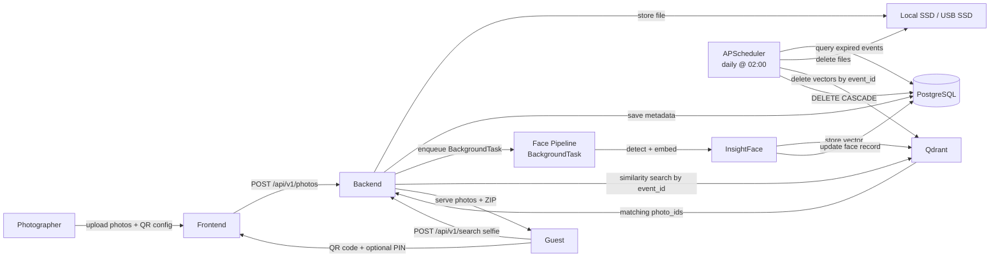

# System Architecture: WeddingLens
Last updated: 2026-06-19
Status: declared

## Services

| Service | Path / Repo | Stack | Purpose |
|---------|-------------|-------|---------|
| backend | `backend/` | Python 3.12, FastAPI | REST API, in-process face processing pipeline (BackgroundTasks), in-process scheduled jobs (APScheduler), photo and event management |
| frontend | `frontend/` | TypeScript, Next.js 14 | Guest gallery, QR+PIN access, face search UI, ZIP download |

## Communication

| From | To | Protocol | Notes |
|------|----|----------|-------|
| frontend | backend | REST/HTTP | JSON API, `/api/v1/` prefix, port 8000 in dev |
| backend | Qdrant Cloud | HTTPS | Vector similarity search, queries scoped per `event_id`; hosted externally on Qdrant Cloud free tier |
| backend | PostgreSQL | TCP | Events, photos, guests, face record metadata |
| backend | Storage | Local SSD / USB SSD | Photo file read/write (`STORAGE_PATH` env var) |

## Data Stores

| Store | Type | Owned by | Notes |
|-------|------|----------|-------|
| PostgreSQL | Relational DB | backend | Events, photos, face records (metadata only) |
| Qdrant Cloud | Vector DB (external) | backend | 512-dim ArcFace embeddings; filtered by `event_id`; free tier on Qdrant Cloud |
| Local SSD / USB SSD | File system | backend | Original and processed photo files; path set via `STORAGE_PATH`. May be an external USB SSD for per-event portability. |

## Deployment

Single VM — 4-core CPU, 16GB RAM, local SSD or attached USB SSD. All services (backend, frontend, Qdrant, PostgreSQL) run on the same machine. Per-event use: photos indexed once, guests search during the event or afterwards.

## Data Flow

## Open Questions

