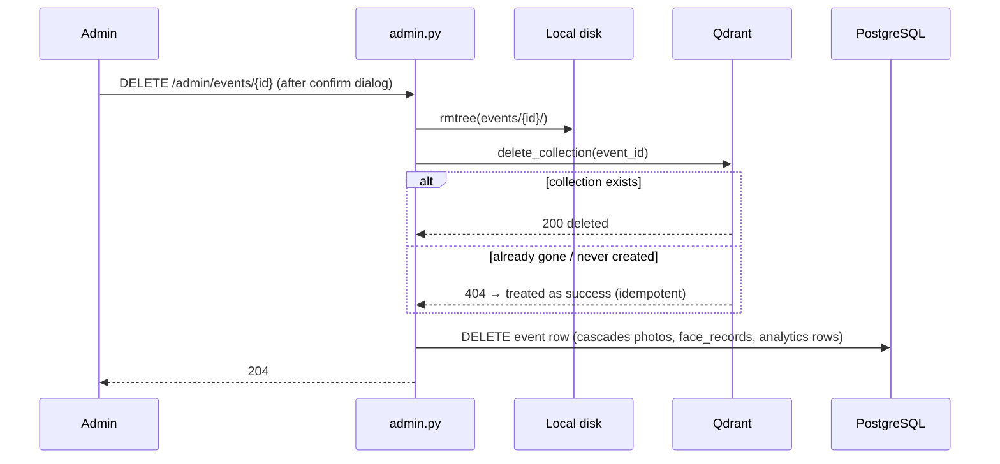
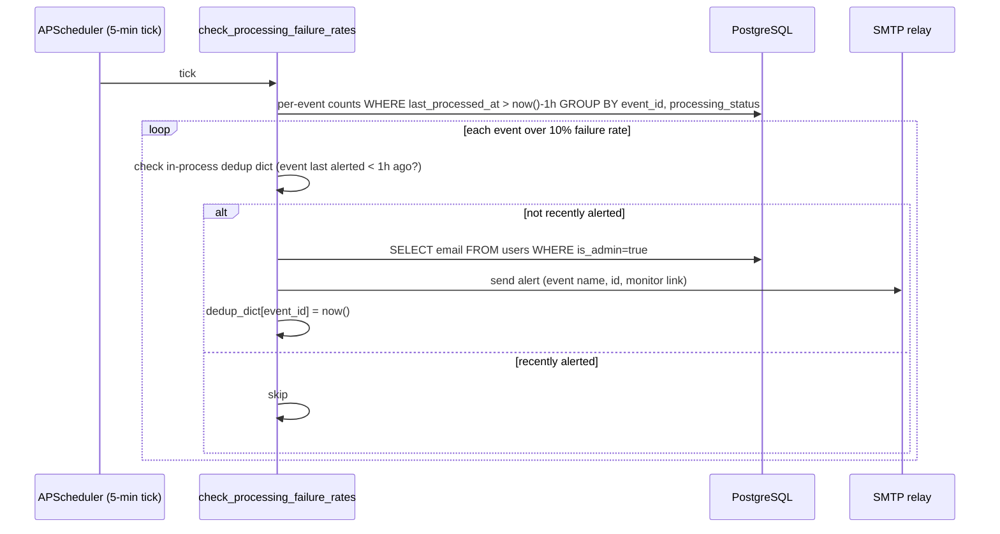
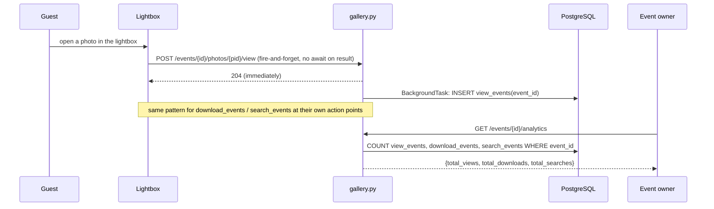

# Design: Admin Platform & Analytics

**Status:** Designed — ready for /build
**Date:** 2026-08-15
**Requirements:** `docs/features/admin-platform/requirements.md`
**Epic:** `docs/epics/admin-platform/EPIC.md`

Scenarios 1–3 (event list, suspend/unsuspend, hard delete) are already partially shipped under
Event Management (#12) — this design closes their two gaps (missing list/detail context fields;
stubbed Qdrant deletion) and adds the four net-new scenarios: processing monitor, failure-rate
alerting, event-owner analytics, and the platform health dashboard.

---

## Existing building blocks this design reuses

| Asset | Location | Used for |
|-------|----------|----------|
| `ix_photos_event_status` index on `(event_id, processing_status)` | `backend/app/models/photo.py:32` | Processing monitor and failure-rate queries — no new index needed |
| `Photo.last_processed_at` | `backend/app/models/photo.py:60` | Windowing for the 1-hour failure-rate check (S5) and the 24-hour platform error rate (S7) — same field `retry.py` already uses for its stuck-job threshold |
| `Photo.download_count` (per-photo counter, incremented in `gallery.py:download_photo`) | `backend/app/routers/gallery.py:144` | **Not reused** — stays as-is for the per-photo "downloads" badge already shown in the gallery UI. The new `download_events` table (below) is additive, for event-level aggregation, not a replacement. Flagged explicitly so build doesn't try to derive Scenario 6 totals from this column and miss ZIP downloads (which don't increment it). |
| `qdrant.delete_collection(event_id)` | `backend/app/services/qdrant.py:94` | Already exists and does the real work — REQ-3a is "call this instead of the stub," not new Qdrant code |
| `retry_failed_photos` APScheduler job (5-min cadence) | `backend/app/services/retry.py`, registered in `main.py` | Pattern mirrored for the new failure-rate check job (S5) — same registration style, same interval |
| `require_admin` dependency | `backend/app/dependencies.py` | All new admin endpoints (S4, S7) |
| `get_event_with_photographer_access` / ownership check pattern | `backend/app/dependencies.py` | Event-owner analytics endpoint (S6) — same "does this user own/manage this event" check already used for photographer routes |
| `get_validated_guest_event` dependency | `backend/app/dependencies.py`, used throughout `gallery.py`/`search.py` | The new guest-facing view beacon (S6) — same guest-session auth as every other gallery route |

---

## Design decisions

### D1 — Admin list/detail context fields computed at query time, not denormalized
REQ-1/REQ-2 need photo count, storage used, and last activity alongside each event. These are
computed via aggregation queries at request time (`COUNT`, `SUM(file_size)`, `MAX(created_at)`
grouped by `event_id`), not stored as columns on `Event`.

**Rejected:** denormalizing onto `Event` (e.g. `Event.photo_count`) — would need triggers or
write-path updates everywhere a photo is added/removed/reassigned, and NFR-7b already states no
real-time requirement. A batch query at read time is simpler and cannot drift out of sync.

- **Event list** (`GET /api/v1/admin/events`, amended): adds `photo_count`, `storage_used_bytes`,
  `last_activity_at` to each row via a single query with a `LEFT JOIN` + `GROUP BY event_id`
  aggregate subquery (avoids N+1 — one query for the whole page, not one per event). Supports
  `?status=` filter and `?sort=last_activity|photo_count` (REQ-1).
- **Event detail** (`GET /api/v1/admin/events/{event_id}`, new): the three fields above *plus* the
  processing monitor breakdown (D3) in one response — this is the "admin event detail view" REQ-2
  and REQ-4b refer to, which does not exist as a distinct endpoint today (only list + action
  endpoints do). `last_activity_at` falls back to `Event.updated_at` when the event has no photos
  yet (freshly created draft).

### D2 — Replace the Qdrant hard-delete stub, in place, with idempotent handling *(REQ-3a)*
`qdrant.delete_collection()` already exists and does real work — it was simply never wired up.
Swap both call sites (`backend/app/routers/admin.py:161` and `backend/app/services/purge.py:78`)
from `_stub_qdrant_delete(event_id)` to `qdrant.delete_collection(event_id)`, then delete the now-dead
`_stub_qdrant_delete` function.

`delete_collection` must additionally catch `UnexpectedResponse` for a 404 (collection already
gone / never created because the event had no photos) and treat it as success — matching the
existing idempotency pattern in `qdrant.search_faces` (which already catches "collection doesn't
exist" the same way). Without this, re-running the purge job on an event whose collection was
already deleted (or that never had photos) would raise instead of no-op, violating the module's own
documented idempotency guarantee ("re-running on the same event is safe").

**Rejected:** merging `admin.py`'s inline hard-delete with `purge.py`'s `_purge_single_event` into
one shared function. They do overlapping work, but `admin.py`'s delete deliberately uses the
request's own `db` session ("keeps test DB consistent" per its existing comment) while
`_purge_single_event` opens its own `AsyncSessionLocal()`. Merging them is a real refactor with a
session-handling wrinkle that's out of proportion to REQ-3a's actual scope (swap a stub for a real
call). Not worth the risk in this pass.

### D3 — Processing monitor exposes all 5 real states, not the 4 in REQ-4a
The pipeline actually has 5 `processing_status` values: `pending`, `processing`, `complete`,
`failed` (retryable, `processing_attempts < 5`), and `error` (exhausted retries, terminal — see
`face_pipeline.py:243`). REQ-4a's 4-bucket model (pending / in-progress / failed / completed)
doesn't have a slot for "exhausted retries vs. still-retryable."

**Decision:** the monitor response exposes all 5 counts (`pending`, `processing`, `complete`,
`failed`, `error`). REQ-4a's "failed" bucket = `failed + error` summed for admins who just want the
4-bucket view; the finer split lets an admin distinguish "still auto-retrying" from "needs manual
intervention" without extra scope. One `GROUP BY processing_status` query per event, using the
existing `ix_photos_event_status` index.

### D4 — Failure-rate alerting: in-process dedup state, plain SMTP, no third-party service
New APScheduler job `check_processing_failure_rates`, registered at 5-minute intervals (REQ-5c),
alongside the existing `retry_failed_photos` job. Per event with any `complete`/`failed`/`error`
photo whose `last_processed_at` falls in the trailing 1-hour window: `rate = (failed + error) /
(failed + error + complete)`. If `rate > 0.10`, email every user with `is_admin = true`.

- **Recipient:** all `is_admin=true` users' registered emails (queried from `User`, not a new
  config setting) — avoids a separate `ADMIN_ALERT_EMAIL` value that could drift from who's
  actually an admin.
- **Delivery:** stdlib `smtplib` against an operator-configured SMTP relay (new settings:
  `SMTP_HOST`, `SMTP_PORT`, `SMTP_USER`, `SMTP_PASSWORD`, `SMTP_FROM` — same `.env` pattern as
  every other credential in `config.py`). No third-party alerting SDK (REQ-5b, Out of Scope).
- **Dedup:** an in-process `dict[event_id, last_alerted_at]` inside the job module, checked before
  sending — mirrors the in-process pattern already established for guest rate limiting and
  favourites (ADRs `2026-06-22-guest-search-in-process-rate-limiter`, `2026-06-20-favourites-in-process-store`).
  Resets on restart, which is an acceptable MVP fail-open exactly like the search rate limiter's
  documented trade-off (NFR-4 explicitly allows in-memory *or* Postgres — in-process chosen for
  consistency with the codebase's existing convention, not because Postgres was ruled out).

See ADR `docs/decisions/2026-08-15-admin-alert-in-process-dedup.md`.

### D5 — Three new event-scoped analytics tables, one row per action, CASCADE-deleted with the event
`view_events`, `download_events`, `search_events` — each just `(id, event_id, occurred_at)`. No
guest identity, no dedup key (per the grooming decision: raw counts only).

- **Views (S6):** new guest-facing beacon `POST /api/v1/events/{event_id}/photos/{photo_id}/view`,
  fire-and-forget from the frontend Lightbox component on open (one call per open, not per thumbnail
  render in the grid — grid scrolling must not generate view rows, only an explicit open). Backend
  write is itself fire-and-forget via `BackgroundTasks` (NFR-3) — the beacon response returns
  immediately regardless of whether the insert succeeds.
- **Downloads (S6):** a `download_events` row is written on (a) single-photo download completion
  (`gallery.py:download_photo`, alongside the existing `download_count` increment — both fire from
  the same request, no conflict) and (b) ZIP download completion (`zip_streaming.py`) — **one row
  per ZIP request**, not one per photo inside it, matching REQ-6b's "one row per download action."
- **Searches (S6):** a `search_events` row is written in `face_search.run_search` on every
  completed request, including cache hits — a repeat search is still guest engagement from the
  owner's perspective, and cache hits already skip the expensive detection work, so there's no
  performance reason to exclude them.
- **Lifecycle:** `ON DELETE CASCADE` from `events` — these are lifetime-of-the-event analytics, not
  a compliance-retention record like `consent_records`/`removal_requests` (no NFR here demands they
  survive event deletion, unlike the privacy-security tables).

**Rejected:** reusing `Photo.download_count` for Scenario 6 (see D-table note above) — it's already
shipped for a different purpose (per-photo badge) and doesn't cover ZIP downloads.

### D6 — Platform health dashboard: batch queries, no caching
`GET /api/v1/admin/health` (new): `COUNT(*)` on events (all statuses), `COUNT(*)` on photos,
`SUM(file_size)` on photos, and a 24-hour error rate using the same `failed + error` / `(failed +
error + complete)` shape as D4 but platform-wide and windowed on `last_processed_at` over 24h
instead of per-event over 1h. REQ-7b already states no real-time requirement and NFR-1 caps this at
≤500 events — four aggregate queries at request time comfortably meet the 3-second budget without
caching.

---

## Data model

```sql
-- Guest photo view beacon (S6). Fire-and-forget, no guest identity, CASCADE with event.
view_events(
  id           uuid pk,
  event_id     uuid not null references events(id) on delete cascade,
  occurred_at  timestamptz not null default now()
)

-- Download actions, one row per action — a ZIP download is ONE row, not one per photo (S6).
download_events(
  id           uuid pk,
  event_id     uuid not null references events(id) on delete cascade,
  occurred_at  timestamptz not null default now()
)

-- Face searches performed, including cache hits (S6).
search_events(
  id           uuid pk,
  event_id     uuid not null references events(id) on delete cascade,
  occurred_at  timestamptz not null default now()
)
```

Indexes: `(event_id, occurred_at)` on all three — the analytics endpoint (D5/S6) filters by
`event_id` only for MVP (all-time totals, no date-range UI in scope), but the index keeps a future
date-windowed query cheap without a migration.

No new columns on `Photo` or `Event` — D1's list/detail context and D3's monitor are computed from
existing columns (`file_size`, `created_at`, `processing_status`, `last_processed_at`).

---

## Flows

### Admin hard delete — real Qdrant deletion (S3, REQ-3a)


### Failure-rate alert job (S5)


### Guest view beacon + analytics read (S6)


---

## New endpoints summary

| Endpoint | Scenario | Auth |
|----------|----------|------|
| `GET /api/v1/admin/events` (amended) | S1 | admin |
| `GET /api/v1/admin/events/{event_id}` (new) | S2, S4 | admin |
| `GET /api/v1/admin/health` (new) | S7 | admin |
| `GET /api/v1/events/{event_id}/analytics` (new) | S6 | event owner (ownership-checked) |
| `POST /api/v1/events/{event_id}/photos/{photo_id}/view` (new) | S6 | guest session |
| APScheduler job `check_processing_failure_rates` (new, 5-min) | S5 | — (internal) |

`download_events`/`search_events` writes are side effects of existing endpoints
(`gallery.py:download_photo`, ZIP streaming, `face_search.run_search`) — no new routes for those two.

---

## New settings (`.env` / `config.py`)

```
SMTP_HOST=
SMTP_PORT=587
SMTP_USER=
SMTP_PASSWORD=
SMTP_FROM=alerts@weddinglens.example
ADMIN_FAILURE_RATE_THRESHOLD=0.10
ADMIN_FAILURE_RATE_WINDOW_MINUTES=60
ADMIN_ALERT_DEDUP_MINUTES=60
```

---

## ADRs written with this design
- `docs/decisions/2026-08-15-admin-alert-in-process-dedup.md` (D4)

(D1–D3, D5, D6 are additive/query-time patterns following existing conventions — captured here, no
separate ADR.)

---

## Constraint check (`docs/architecture/constraints.md`)
- ✅ Rule 3 (event-scoping): all new tables and queries are scoped by `event_id`; the owner
  analytics endpoint enforces ownership (REQ-6c) the same way photographer routes already do.
- ✅ Rule 4/5 (frontend→backend only, backend owns stores): the view beacon and all analytics reads
  go through the backend API; no new direct store access.
- ✅ Rule 6 (idempotent jobs): D2 explicitly restores idempotency to the Qdrant delete step; the
  failure-rate job is read-then-conditionally-write and safe to re-run (dedup is time-based, not a
  one-shot claim).
- ✅ Logging standard (no PII): view/download/search events carry no guest identity — `event_id` +
  timestamp only.
- ⚠️ No rule violated. The `smtplib`/SMTP relay is a new outbound dependency not previously in the
  trust-boundary table — worth a one-line addition to `constraints.md`'s trust boundaries at build
  time (backend → SMTP relay, admin-alert path only).

---

## Open questions
- [ ] Which SMTP relay/credentials will the deployment actually use? — owner: Ops/Engineering, not
  a design blocker (settings are provider-agnostic `smtplib` config).
- [ ] Should the view/download/search event tables get a retention cap (e.g., roll up to daily
  aggregates after N days) once event volume is real? — owner: Engineering, post-MVP; MVP keeps raw
  rows, all-time totals only, per Out of Scope (no date-range analytics UI yet).
- [ ] Carried over from grooming: admin promotion via manual DB update — fine long-term, or a
  promotion UI post-MVP? — owner: Engineering, not a build blocker.
