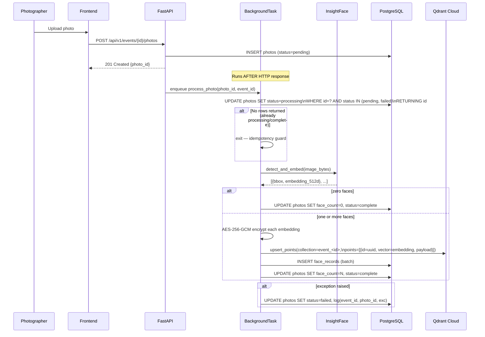
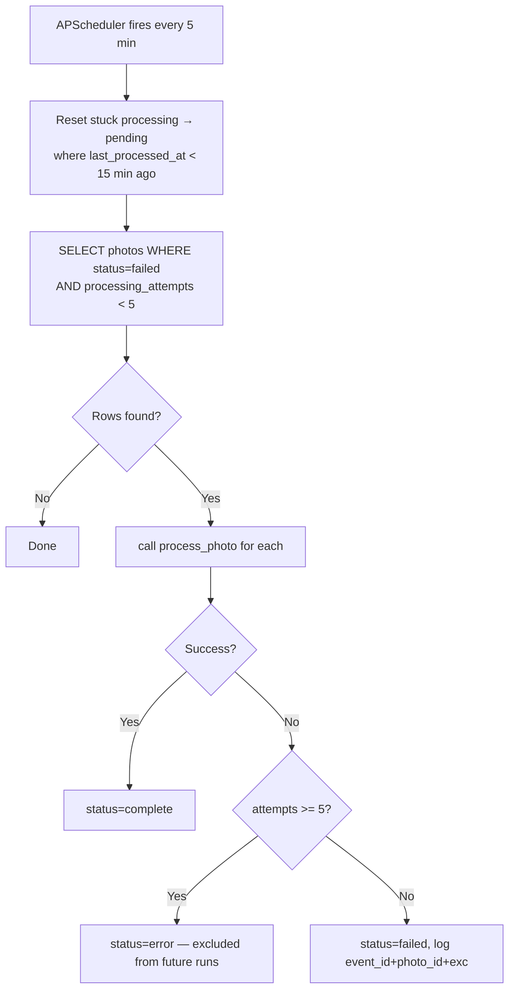

# AI Face Processing Pipeline — Design

**Status:** Ready for review
**Author:** Engineering
**Date:** 2026-06-19
**Epic:** [docs/epics/ai-face-processing/EPIC.md](../../epics/ai-face-processing/EPIC.md)
**Requirements:** [requirements.md](./requirements.md)

---

## Problem Statement

Every uploaded photo must have its faces detected, embedded (512-dim ArcFace), and stored in Qdrant before the guest gallery goes live. Processing must be async, idempotent, retryable, and the embeddings must be encrypted at rest.

---

## Critical Design Issue: Encryption vs. Search

NFR-2 states: *"AES-256 encryption must be applied to face embedding vectors before they are stored in Qdrant."*

Vectors AES-encrypted before Qdrant write are opaque bytes — Qdrant cannot compute similarity on them. This directly conflicts with the search requirement.

### Resolution: Dual Storage (selected)

- Store vectors **plaintext in Qdrant Cloud** (Qdrant Cloud provides infrastructure-level encryption at rest via its managed service; this satisfies the at-rest intent for the search index).
- Store an **AES-256-GCM encrypted copy of each raw embedding** in `face_records.embedding_enc` (PostgreSQL). This is the application-level "encrypted at rest" artifact, guarded by `SECRET_KEY`.

This is the only design that satisfies both searchability and application-level encryption at wedding scale. See [ADR: Face Embedding Dual Storage](../../decisions/2026-06-19-face-embedding-dual-storage.md).

---

## Resolved Open Questions

| Question | Decision | Rationale |
|----------|----------|-----------|
| Qdrant collection naming | `event_<uuid_no_dashes>` | Stable, no rename on event slug change, guaranteed unique |
| AES encryption mode | AES-256-GCM | Authenticated encryption — detects tampering; nonce prepended to ciphertext |
| Per-photo error surface | Per-photo `failed`/`error` status exposed via status endpoint | Photographer needs to know which specific photos are unindexed |
| Retry cap | 5 attempts → permanent `error` state | Prevents runaway retries; `error` photos excluded from APScheduler |

---

## Data Model

### `photos` (new table)

| Column | Type | Notes |
|--------|------|-------|
| `id` | UUID PK | |
| `event_id` | UUID FK → events | CASCADE delete |
| `album_id` | UUID FK → albums | nullable |
| `filename` | TEXT | original filename |
| `storage_path` | TEXT | path relative to `STORAGE_PATH` |
| `file_size` | BIGINT | bytes |
| `width` | INT | nullable, populated post-processing |
| `height` | INT | nullable |
| `face_count` | INT | nullable; 0 = no faces; set on complete |
| `processing_status` | VARCHAR(20) | `pending \| processing \| complete \| failed \| error` |
| `processing_attempts` | INT | default 0; capped at 5 before `error` |
| `last_processed_at` | TIMESTAMPTZ | nullable; updated on each processing attempt |
| `created_at` | TIMESTAMPTZ | |
| `updated_at` | TIMESTAMPTZ | |

Index: `(event_id, processing_status)` — used by APScheduler retry queries.

### `face_records` (new table)

| Column | Type | Notes |
|--------|------|-------|
| `id` | UUID PK | |
| `photo_id` | UUID FK → photos | CASCADE delete |
| `event_id` | UUID FK → events | denormalized for per-event queries; CASCADE delete |
| `qdrant_point_id` | UUID NOT NULL | matches the Qdrant vector point ID |
| `bbox_x` | INT | bounding box top-left x |
| `bbox_y` | INT | bounding box top-left y |
| `bbox_w` | INT | bounding box width |
| `bbox_h` | INT | bounding box height |
| `embedding_enc` | BYTEA NOT NULL | AES-256-GCM encrypted float32[512] bytes |
| `created_at` | TIMESTAMPTZ | |

Indexes: `(event_id)`, `(photo_id)`.

---

## Pipeline Design

### Upload flow (sync + async)



### Idempotency

The status transition is the single idempotency gate:

```sql
UPDATE photos
SET status = 'processing',
    processing_attempts = processing_attempts + 1,
    last_processed_at = NOW()
WHERE id = :photo_id
  AND status IN ('pending', 'failed')
RETURNING id
```

If this returns zero rows, the job exits immediately — no detection, no writes. This prevents:
- APScheduler and BackgroundTask racing on the same photo
- Duplicate runs after backend restart (photo stays in `processing`)

### Stuck-job recovery

APScheduler runs every 5 minutes. Before retrying failed photos, it first resets stuck `processing` jobs:

```sql
UPDATE photos
SET status = 'pending'
WHERE status = 'processing'
  AND last_processed_at < NOW() - INTERVAL '15 minutes'
```

### Retry flow



---

## Qdrant Collection Schema

### Naming

`event_<uuid_hex>` — e.g. `event_550e8400e29b41d4a716446655440000`

UUID without dashes (32 hex chars). Stable across event slug renames.

### Collection spec

```python
VectorParams(size=512, distance=Distance.COSINE)
```

### Point structure

```json
{
  "id": "<face_record_id_uuid>",
  "vector": [0.12, -0.34, ...],   // float32[512], plaintext for search
  "payload": {
    "photo_id": "uuid",
    "event_id": "uuid",
    "bbox": [x, y, w, h]
  }
}
```

No PII, no encrypted data in Qdrant payload.

### Collection lifecycle

| Event | Action |
|-------|--------|
| Event created | `create_collection(name=event_<id>, ...)` |
| Photo processed | `upsert_points(...)` |
| Event deleted / purged | `delete_collection(name=event_<id>)` |

Collection creation is owned by the Event Management epic; this epic consumes it.

---

## Encryption Scheme

```
raw_bytes   = embedding_float32.tobytes()          # 2048 bytes (512 * 4)
key         = HKDF(SECRET_KEY, salt="wl-face-emb", length=32)
nonce       = os.urandom(12)                       # 96-bit GCM nonce
ct, tag     = AESGCM(key).encrypt(nonce, raw_bytes, associated_data=None)
stored      = nonce + ct + tag                     # 12 + 2048 + 16 = 2076 bytes → face_records.embedding_enc
```

Key derivation via HKDF (not raw `SECRET_KEY`) enables key rotation without data migration: derive a new key at a new HKDF info string and re-encrypt lazily.

---

## Processing Status Endpoint

`GET /api/v1/events/{event_id}/face-processing/status`

**Auth:** JWT required (photographer / event owner). Returns 403 for guest-scoped tokens.

**Response:**
```json
{
  "event_id": "uuid",
  "total_photos": 100,
  "by_status": {
    "pending": 5,
    "processing": 2,
    "complete": 88,
    "failed": 3,
    "error": 2
  }
}
```

Query: `SELECT processing_status, COUNT(*) FROM photos WHERE event_id=? GROUP BY processing_status`. No cache — satisfies REQ-22 (< 5 s staleness).

---

## Build Tasks

1. **Alembic migration** — add `photos` and `face_records` tables
2. **InsightFace service** — `app/services/face_pipeline.py`: detect + embed, min face 40×40px
3. **Encryption util** — `app/utils/crypto.py`: HKDF key derivation, AES-256-GCM encrypt/decrypt
4. **Qdrant service** — `app/services/qdrant.py`: upsert points, delete collection (used by Event Management epic too)
5. **Photo upload router** — `app/routers/photos.py`: `POST /api/v1/events/{id}/photos`, enqueue BackgroundTask
6. **APScheduler retry job** — extend `app/services/purge.py` or add `app/services/retry.py`
7. **Status endpoint** — extend `app/routers/photos.py` or add `app/routers/face_status.py`
8. **Tests** — pytest for pipeline (mock InsightFace), idempotency, encryption round-trip, retry flow, status endpoint auth

---

## Constraints Satisfied

| Constraint | How |
|------------|-----|
| Upload must not block on face processing | BackgroundTask runs after HTTP response |
| Embeddings encrypted at rest | AES-256-GCM in `face_records.embedding_enc` (PG); Qdrant Cloud infra encryption for search vectors |
| Searches scoped per event_id | One Qdrant collection per event; no cross-collection queries |
| Backend owns all data stores | InsightFace, Qdrant, PG all called only from backend |
| Face jobs idempotent | Atomic status-gate UPDATE; stuck-job reset |

---

## Open Questions

- [x] **OQ-3 product confirmation:** Per-photo `failed`/`error` status must be visible in the photographer dashboard (not just aggregate counts). — resolved 2026-06-19
- [x] **Encryption option confirmation:** Option A (dual storage) confirmed. Migration can proceed. — resolved 2026-06-19
