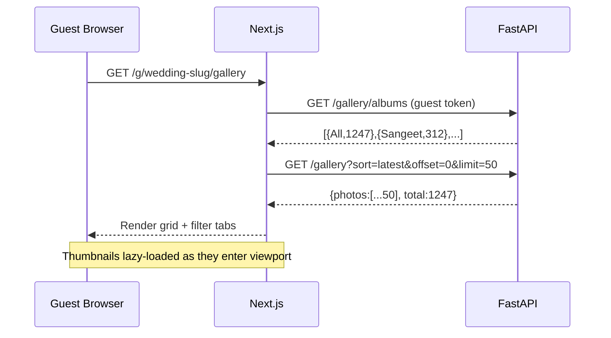
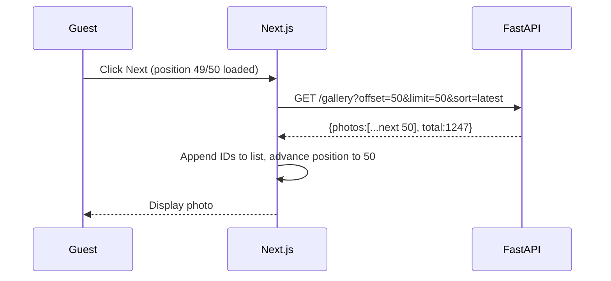

# Album Gallery — Design

Status: draft
Date: 2026-06-20
Epic: docs/epics/album-gallery/EPIC.md
Requirements: docs/features/album-gallery/requirements.md

---

## Context

The album gallery is the primary browsing surface for wedding guests. It must handle events with 50,000+ photos through server-side pagination (50-photo batches, "Load more"), support album category filters and three sort orders, open individual photos in a full-screen lightbox with prev/next navigation, and encode all view state in the URL.

Current state of the codebase relevant to this feature:

| Thing | State |
|-------|-------|
| `photos` table | Exists. Has `album_id FK`, `created_at`, `storage_path`. **Missing** `download_count`, `is_photographer_choice`, `thumbnail_path`. |
| `albums` table | Exists. Has `ceremony_category`, `name`, `sort_order`. |
| Guest auth dependency | `get_validated_guest_event()` in `app/dependencies.py` — ready to use. |
| Gallery frontend page | `app/g/[slug]/gallery/page.tsx` — stub ("Photos coming soon"). |
| Photo serving | No serving endpoint exists — only upload and face-processing status. |

Three design decisions are open before implementation can start.

---

## Decision 1 — Thumbnail strategy (resolves OQ-3)

Gallery grid thumbnails must be lightweight (NFR-2: lazy-loaded, no original-res on grid render). There are three options.

### Option A — Generate during face pipeline BackgroundTask (Recommended)

When the face pipeline processes a photo, also write a WebP thumbnail (~600 px wide) to `events/{event_id}/thumbs/{photo_id}.webp` on the SSD. Store the relative path in `photos.thumbnail_path`. The gallery endpoint returns `thumbnail_url = GET /events/{event_id}/photos/{photo_id}/thumbnail`.

```
upload → BackgroundTask → InsightFace embed + Pillow resize → thumbnail written to SSD
gallery request → backend streams thumbnail from SSD
```

**Pros:** Zero cost on the read path. No per-request CPU. Works at any concurrency.
**Cons:** Thumbnails not available until the face pipeline completes. Photos uploaded and not yet processed show no thumbnail (show a placeholder in the UI).
**Fallback:** If `thumbnail_path` is NULL (pipeline not done), the gallery endpoint returns `thumbnail_url = null` and the frontend renders a placeholder.

### Option B — On-demand resize with disk cache

The thumbnail endpoint resizes on first request using Pillow and writes the result to the cache dir. Subsequent requests stream from disk.

**Pros:** No pipeline dependency — thumbnails available immediately after upload.
**Cons:** First-load latency for any photo. Cache management (invalidation, disk pressure). CPU spikes if many thumbnails are cold.

### Option C — Browser-side resize (no backend thumbnails)

Return the original image URL. Browser downloads the full file; `` is constrained by CSS.

**Pros:** No backend work.
**Cons:** Violates NFR-2 and NFR-3. Kills performance for large events. Not viable.

**Recommendation: Option A.** The face pipeline already touches every photo; a Pillow resize adds ~5–15 ms per photo and produces a permanent artefact. The read path stays cheap.

**Open question resolved:** OQ-3 — WebP format, 600 px wide (height proportional), stored on SSD alongside originals.

---

## Decision 2 — Lightbox navigation beyond the loaded batch (resolves OQ-2)

The lightbox shows one photo at a time and must support Prev/Next within the same filter+sort context (REQ-13). Photos beyond the loaded batch must be reachable.

### Option A — Frontend batch auto-fetch (Recommended)

The frontend holds the ordered list of loaded photo IDs. When the user navigates past the last loaded photo, the frontend fetches the next batch automatically and appends. The lightbox stays open while the batch loads.

```
Lightbox at photo #50 → Next → frontend fetches offset=50 → appends 50 IDs → lightbox advances
```

**Pros:** No additional backend endpoint. The gallery list endpoint doubles as the navigation source. URL state (`limit`) tracks total loaded count correctly.
**Cons:** Frontend must manage a growing in-memory ID list and track the current cursor position within it. "Fetch on demand" adds a brief loading state in the lightbox for the first photo of a new batch.

### Option B — Backend `adjacent` endpoint

`GET /api/v1/events/{event_id}/gallery/{photo_id}/adjacent?sort=latest&album=Sangeet`
Returns `{prev_id, next_id}`. The frontend fetches this on every Prev/Next press.

**Pros:** No client-side list management. Works for arbitrarily deep navigation without the frontend holding all IDs.
**Cons:** Each Prev/Next = one API round-trip (~50–100 ms). Implementing `prev_id/next_id` requires a rank or offset query per photo, which is expensive at scale (finding the position of a given photo in a sorted 50k list).

### Option C — Navigate only within loaded photos

Disable the Next button when the lightbox reaches the last loaded photo. Users must close the lightbox and click "Load more".

**Pros:** Trivial to implement.
**Cons:** Poor UX. Requirement REQ-13 implies seamless navigation; Option C is non-compliant for photos beyond the first loaded batch.

**Recommendation: Option A.** The implementation cost (a ref holding an array of IDs + a position cursor) is modest. No extra backend endpoint. The brief load state on batch boundaries is acceptable and can be smoothed with a spinner.

**Open question resolved:** OQ-2 — auto-fetch next batch at lightbox boundary.

---

## Decision 3 — Batch size for "Load more" (resolves OQ-1)

Fixed at **50** per REQ-3. No configuration needed. The `limit` query parameter on the gallery API is always 50 for a fresh page; the `limit` URL parameter tracks the total loaded count (`50 × batches`).

---

## Data Model Changes

**Migration 004** adds three columns to `photos` and the required gallery indexes.

### New columns

| Column | Type | Default | Purpose |
|--------|------|---------|---------|
| `download_count` | `INTEGER NOT NULL DEFAULT 0` | 0 | Tracks downloads for Popular sort |
| `is_photographer_choice` | `BOOLEAN NOT NULL DEFAULT FALSE` | false | Photographer Choice flag |
| `thumbnail_path` | `TEXT NULL` | null | SSD-relative path to WebP thumbnail |

### New indexes

Six composite indexes to serve all three sort orders for both the "All" tab (no album filter) and the per-album tabs:

```sql
-- All tab
CREATE INDEX ix_photos_gallery_all_latest   ON photos(event_id, created_at DESC);
CREATE INDEX ix_photos_gallery_all_popular  ON photos(event_id, download_count DESC);
CREATE INDEX ix_photos_gallery_all_choice   ON photos(event_id, is_photographer_choice DESC, created_at DESC);

-- Category tabs (album_id IS NOT NULL filter)
CREATE INDEX ix_photos_gallery_alb_latest   ON photos(event_id, album_id, created_at DESC);
CREATE INDEX ix_photos_gallery_alb_popular  ON photos(event_id, album_id, download_count DESC);
CREATE INDEX ix_photos_gallery_alb_choice   ON photos(event_id, album_id, is_photographer_choice DESC, created_at DESC);
```

The album-count query for tab badges uses the existing `ix_photos_event_status` index plus a GROUP BY on `album_id` — no extra index needed.

---

## API Design

Seven endpoints total. All guest endpoints use `get_validated_guest_event` for auth and return `X-Guest-Token` for sliding refresh. All owner endpoints use `get_current_user` + ownership check.

```
# Guest-facing
GET  /api/v1/events/{event_id}/gallery
GET  /api/v1/events/{event_id}/gallery/albums
GET  /api/v1/events/{event_id}/photos/{photo_id}/thumbnail
GET  /api/v1/events/{event_id}/photos/{photo_id}/download   ← serves file + increments count

# Owner-facing
PATCH /api/v1/events/{event_id}/photos/{photo_id}/photographer-choice
```

### GET /gallery — paginated photo list

```
GET /api/v1/events/{event_id}/gallery
    ?album=Sangeet          # optional — ceremony_category value; absent = All
    &sort=latest            # latest | popular | photographer-choice; default = latest
    &limit=50               # always 50; backend caps at 50
    &offset=0               # 0-based; frontend sends 0, 50, 100 per batch
Authorization: Bearer <guest_token>
```

Response `200 OK`:
```json
{
  "photos": [
    {
      "id": "uuid",
      "thumbnail_url": "/api/v1/events/{event_id}/photos/{id}/thumbnail",
      "is_photographer_choice": false,
      "download_count": 12,
      "created_at": "2026-06-20T10:00:00Z"
    }
  ],
  "total": 1247,
  "limit": 50,
  "offset": 0
}
```

`thumbnail_url` is `null` if `thumbnail_path` is NULL (pipeline pending) — frontend renders a placeholder.

### GET /gallery/albums — tab bar data

```
GET /api/v1/events/{event_id}/gallery/albums
Authorization: Bearer <guest_token>
```

Response `200 OK`:
```json
[
  { "ceremony_category": null, "label": "All", "photo_count": 1247 },
  { "ceremony_category": "Sangeet", "label": "Sangeet", "photo_count": 312 },
  { "ceremony_category": "Haldi", "label": "Haldi", "photo_count": 204 }
]
```

Only categories with `photo_count > 0` are returned. "All" is always first.

### GET /photos/{photo_id}/thumbnail — thumbnail serving

Streams the WebP thumbnail from SSD. Returns `404` if `thumbnail_path` is NULL. Cache headers: `Cache-Control: public, max-age=31536000, immutable` (thumbnails are write-once).

### GET /photos/{photo_id}/download — original download + count

Serves the original-resolution file with `Content-Disposition: attachment`. Atomically increments `download_count` on the `photos` row via `UPDATE photos SET download_count = download_count + 1` before streaming. Guest auth required.

### PATCH /photos/{photo_id}/photographer-choice — toggle flag

```json
{ "is_photographer_choice": true }
```

Owner JWT required. Returns `403` for guest tokens (REQ-20). Returns updated `is_photographer_choice` value.

---

## Frontend Architecture

All gallery state lives in the URL (`?album=Sangeet&sort=popular&limit=150`). The page reads params on mount and restores state before the first fetch (REQ-17, REQ-18).

```
GuestGallery (page)
├── AlbumFilterBar          ← tab per album from /gallery/albums
├── SortSelector            ← Latest | Popular | Photographer Choice
├── PhotoGrid               ← responsive masonry/grid, lazy-loaded thumbnails
│   └── PhotoThumbnail      ← renders thumbnail, shows ✦ badge for photographer-choice
├── LoadMoreButton          ← hidden when offset+50 ≥ total
└── Lightbox (portal)       ← overlay, manages prev/next via in-memory ID list
    ├── OriginalImage       ← fetches /thumbnail first, upgrades to /original on open
    ├── PrevNextControls    ← auto-fetches next batch at list boundary
    └── DownloadButton      ← calls /download endpoint
```

### URL state sync

```typescript
// URL params driven by state; history.pushState on every filter/sort/load-more change
?album=Sangeet&sort=popular&limit=150

// On mount, restore:
// 1. album + sort — set filter state immediately
// 2. limit=150 — fetch 3 sequential batches (offsets 0, 50, 100) before render
```

The restore sequence for `limit > 50` fetches batches sequentially (REQ-18): `await fetch(offset=0)`, `await fetch(offset=50)`, `await fetch(offset=100)`, then render.

### Scroll position preservation (REQ-15)

Before opening the lightbox: `scrollY` is captured into a ref. On lightbox close: `window.scrollTo(0, savedScrollY)`.

---

## Sequence Diagrams

### Default gallery load



### Lightbox — navigating past loaded batch



---

## Open Questions

| # | Question | Owner | Blocker for |
|---|----------|-------|-------------|
| OQ-4 | Thumbnail dimensions — 600 px wide sufficient for 2× retina displays? Or serve two sizes (`1x`, `2x`)? | Design | Implementation |
| OQ-5 | Should the gallery endpoint surface photos in `pending`/`failed` processing status? Current recommendation: yes (show all photos; face data orthogonal to gallery browsing). | Engineering | Implementation |
| OQ-6 | The `download_count` increment on `GET /download` is not transactional with the file stream. If the guest aborts, count is still incremented. Acceptable? | Engineering | — |

---

## Implementation Checklist (build phase)

**Backend:**
- [ ] Migration 004 — add `download_count`, `is_photographer_choice`, `thumbnail_path` + six gallery indexes
- [ ] Update `Photo` ORM model with new fields
- [ ] Update face pipeline — add Pillow WebP thumbnail generation step
- [ ] `GET /gallery` router + service (list query, album filter, three sort orders, offset pagination)
- [ ] `GET /gallery/albums` router + service (album tab counts query)
- [ ] `GET /photos/{id}/thumbnail` — file streaming endpoint
- [ ] `GET /photos/{id}/download` — file streaming + atomic count increment
- [ ] `PATCH /photos/{id}/photographer-choice` — owner only, 403 for guest
- [ ] Tests: gallery list filters + sorts, album counts, photographer-choice 403, download count increment

**Frontend:**
- [ ] Replace gallery page stub with full implementation
- [ ] `AlbumFilterBar` component (tabs with count badges)
- [ ] `SortSelector` component
- [ ] `PhotoGrid` + `PhotoThumbnail` (lazy loading, placeholder for null thumbnail_url, ✦ badge)
- [ ] `LoadMoreButton` + batch fetch logic
- [ ] URL state sync (read on mount, write on every state change)
- [ ] URL restore for `limit > 50` (sequential batch prefetch)
- [ ] `Lightbox` component (portal, prev/next with auto-fetch, scroll restore)
- [ ] `DownloadButton` (calls `/download`, triggers browser save)
- [ ] Photographer Choice indicator on thumbnails
