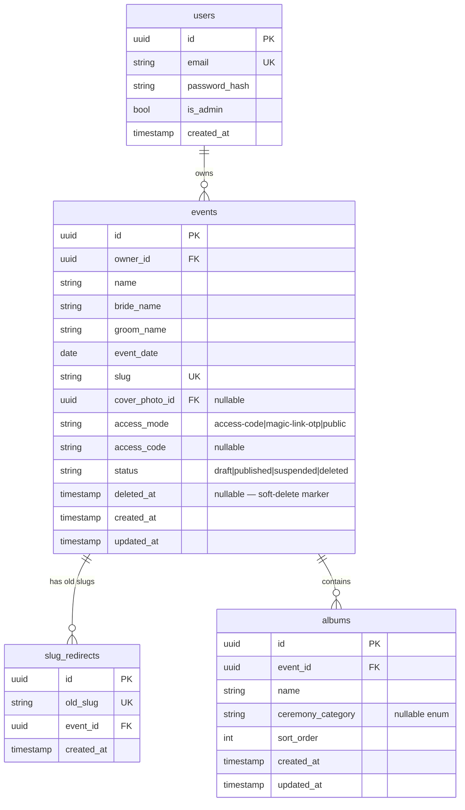
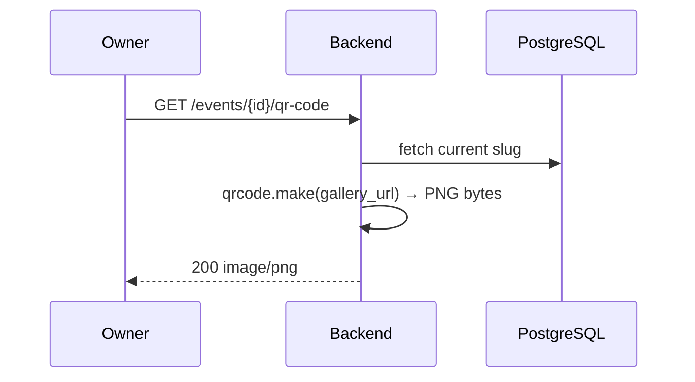
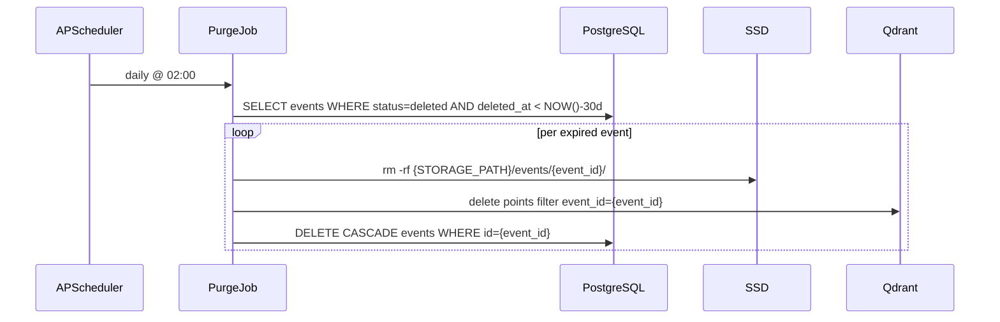
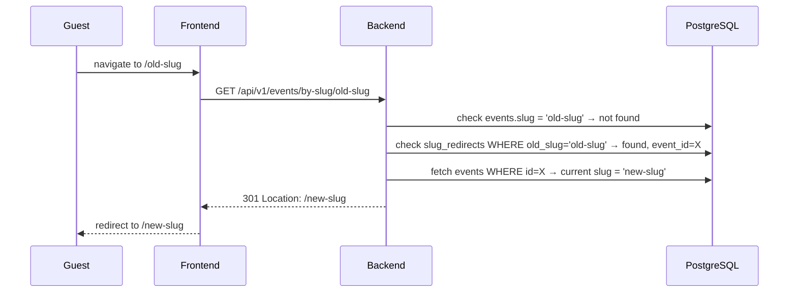
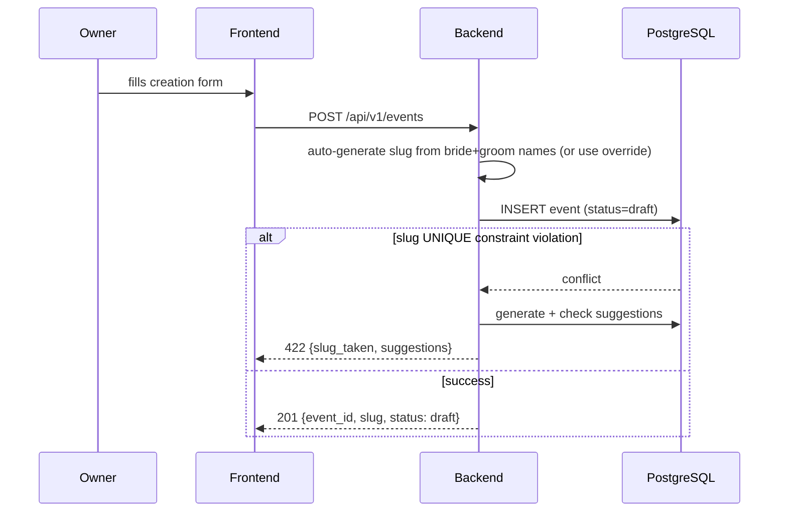
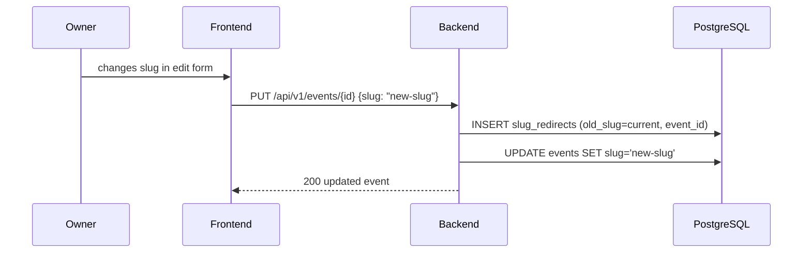
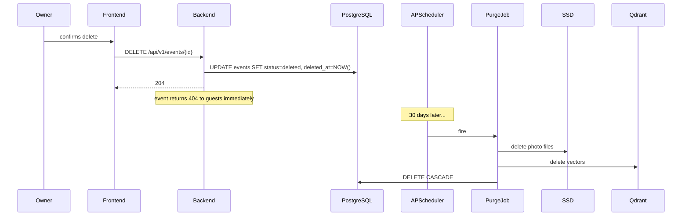

# Design: Event Management (Epic 1)
Date: 2026-06-19
Status: Approved

## Source
Requirements: `docs/features/event-management/requirements.md`
Epic: `docs/epics/event-management/EPIC.md`

---

## Data Model



**Key constraints:**
- `events.slug` — `UNIQUE` index at DB level (NFR-2: no race condition window)
- `deleted_at` set simultaneously with `status = 'deleted'` on soft-delete; both retained for query efficiency
- `slug_redirects.old_slug` — `UNIQUE` index; a slug can only ever map to one current event
- `cover_photo_id` — nullable until cover uploaded; required to publish (REQ-31)
- `access_code` — nullable at DB level; app layer enforces presence when `access_mode = 'access-code'`
- `albums` — max 10 per event enforced at application layer before insert

---

## Decision A: QR Code Strategy — On-Demand Generation

Every `GET /api/v1/events/{id}/qr-code` generates the QR PNG in-process using the `qrcode` Python library and streams the response. No QR files are stored on disk.



**Rationale:** QR generation is <5ms and stateless. Caching on disk adds a staleness risk when the slug changes (REQ-24) with no observable benefit. On-demand always encodes the current slug.

---

## Decision B: 30-Day Purge Job — APScheduler in FastAPI Lifespan

A daily cleanup job registered via APScheduler in the FastAPI `lifespan` context manager purges events where `status = 'deleted'` and `deleted_at < NOW() - 30 days`.



**Consistency guarantee (NFR-3):** Purge runs per-event in a sequential loop. If the job is interrupted mid-run, the next daily run retries any event whose `deleted_at` is still past the threshold and whose records still exist — idempotent by design.

ADR: `docs/decisions/2026-06-19-apscheduler-purge-job.md`

---

## Decision C: Slug Redirects — `slug_redirects` Table + Backend 301

When a slug changes, the old slug is written to `slug_redirects`. The `GET /api/v1/events/by-slug/{slug}` endpoint checks `events.slug` first, then `slug_redirects`. If found in redirects, returns `301 Location: /api/v1/events/by-slug/{current_slug}`.



Handles multi-hop chains (slug changed more than once) without any extra logic — each old slug in the table maps to the event's current slug at query time.

---

## API Surface

```
# Event CRUD (owner JWT required)
POST   /api/v1/events
GET    /api/v1/events/{event_id}
PUT    /api/v1/events/{event_id}
DELETE /api/v1/events/{event_id}                     — soft-delete; sets deleted_at + status=deleted
POST   /api/v1/events/{event_id}/publish             — validates slug + access_mode + cover_photo set
POST   /api/v1/events/{event_id}/unpublish
GET    /api/v1/events/{event_id}/qr-code             — streams PNG on demand

# Album management (owner JWT required)
GET    /api/v1/events/{event_id}/albums
POST   /api/v1/events/{event_id}/albums              — rejected if album count already = 10
PUT    /api/v1/events/{event_id}/albums/{album_id}
DELETE /api/v1/events/{event_id}/albums/{album_id}   — photos → uncategorized; never blocked

# Slug resolution (unauthenticated — guest entry point)
GET    /api/v1/events/by-slug/{slug}                 — 200 event or 301 to current slug or 404

# Admin (admin JWT required)
GET    /api/v1/admin/events                          — paginated; server-side (NFR-4)
POST   /api/v1/admin/events/{event_id}/suspend
POST   /api/v1/admin/events/{event_id}/unsuspend
DELETE /api/v1/admin/events/{event_id}               — hard delete, no grace period, same cascade
```

**Slug conflict response (create + update):**
```json
422 { "detail": "slug_taken", "suggestions": ["priya-rahul-2026", "priya-rahul-june", "priya-rahul-2"] }
```
Suggestions: append year, month name, or incrementing suffix; check each against DB before returning.

---

## Key Flow Diagrams

### Event Creation



### Slug Change (within event update)



### Event Deletion + Grace Period



---

## Constraints Checklist

| Constraint | How satisfied |
|------------|--------------|
| Face processing async (rule 1) | Not touched by this epic — upload not in scope |
| Embeddings encrypted (rule 2) | Purge deletes by event_id filter; no plaintext vectors handled here |
| Searches scoped per event_id (rule 3) | Not touched by this epic |
| Frontend → backend REST only (rule 4) | All frontend calls go to `/api/v1/` |
| Backend owns all data stores (rule 5) | Purge job runs inside FastAPI process — no external script connects to DB |
| Face jobs idempotent (rule 6) | Not touched by this epic |

---

## Open Questions

None. All grooming questions resolved on 2026-06-19.

## Build Notes (not design decisions — builder discretion)

- Slug suggestion algorithm: append `-YYYY`, `-<month>`, or incrementing suffix; implementation detail
- APScheduler version and scheduler type (AsyncIOScheduler vs BackgroundScheduler): builder chooses
- Frontend form layout (wizard vs single-page): frontend builder discretion
