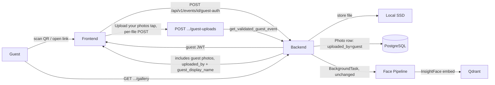
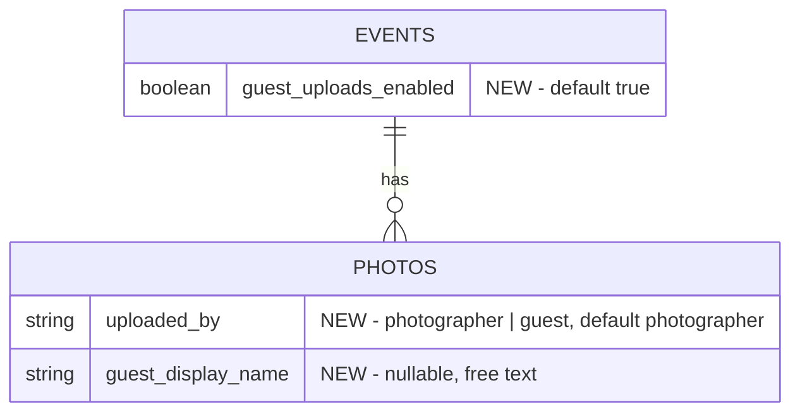
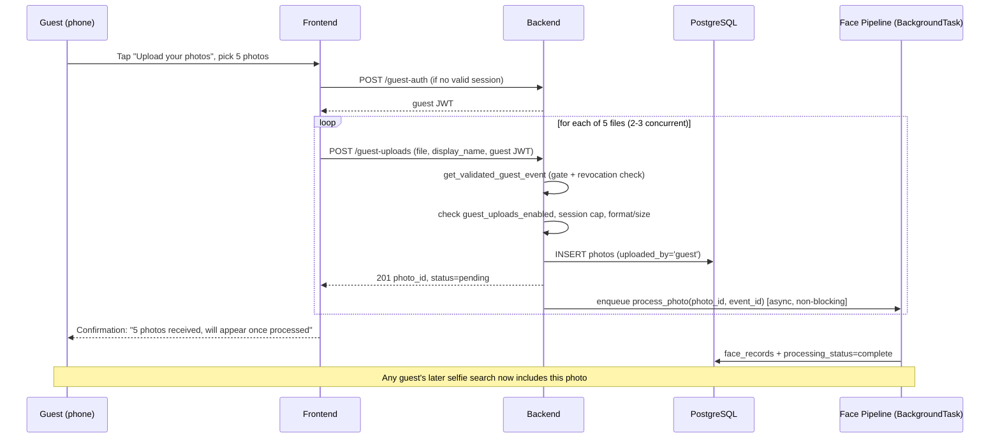

## Feature
docs/features/guest-uploads/requirements.md

## Impact analysis
No existing `docs/wip/analysis-*.md` covers this change. Assessed as **purely additive**:
- New endpoint (`POST /api/v1/events/{event_id}/guest-uploads`), new columns on `Photo` and `Event`, new optional fields on the existing `GalleryListResponse` / `PhotoOut` response shapes.
- No existing endpoint's required request/response contract changes; no existing consumer (frontend gallery, admin dashboard, photographer dashboard) breaks.
- `/analysis` skipped per the purely-additive path in the design gate.

## Architecture fit

Reuses every existing piece of infrastructure — no new service, no new external dependency, no new trust boundary:



Every constraint in `docs/architecture/constraints.md` is satisfied by construction:
1. Face processing stays async — guest upload enqueues the same `background_tasks.add_task(process_photo, ...)` used by photographer uploads; the HTTP response never waits on it.
2. Face embeddings encrypted at rest — unchanged pipeline, no new embedding path.
3. Searches scoped per `event_id` — unchanged; guest photos are just more rows in the same `event_id`-scoped tables.
4/5. Frontend still talks only to the backend REST API; backend still owns all data stores exclusively.
6. Face jobs remain idempotent — same `process_photo(photo_id, event_id)` function, same guarantees.

## Decision — upload request shape

See ADR `docs/decisions/2026-08-19-guest-upload-per-file-requests.md`. Summary: the frontend sends **one `POST` per photo** (not a single batch multipart request, not the photographer's chunked/resumable session), so a dropped connection on venue wifi only loses the one file in flight — files already accepted stand. This directly resolves the "resilience on unreliable wifi" open question from grooming.

## Data model changes



Migration (Alembic, additive only):
- `events.guest_uploads_enabled BOOLEAN NOT NULL DEFAULT true SERVER_DEFAULT 'true'` — mirrors the existing `guest_access_enabled` column pattern.
- `photos.uploaded_by VARCHAR(20) NOT NULL DEFAULT 'photographer' SERVER_DEFAULT 'photographer'` — app-level enum (`"photographer" | "guest"`), same convention as `processing_status` (plain `String`, not a Postgres native enum).
- `photos.guest_display_name VARCHAR(255) NULL` — free text, only ever populated when `uploaded_by = 'guest'`.

No new table. No new index — `event_id` is already indexed on `photos`; gallery listing volume doesn't change in kind, only in source.

**Constraint flag:** `docs/architecture/constraints.md` prohibits logging PII (names, emails, phones). `guest_display_name` is guest-entered free text and must **never** appear in structured logs (upload success/failure logs, background-task failure logs) — log `photo_id` and `event_id` only, exactly as the existing face-pipeline failure logging already does. This is a guardrail for `/build`, not a schema change.

## New endpoint

```
POST /api/v1/events/{event_id}/guest-uploads
Auth: guest JWT (Depends(get_validated_guest_event) — same dependency gallery.py already uses)
Body: multipart/form-data
  file: UploadFile (required)
  display_name: str | None (optional form field, ≤100 chars, sent with every file in a session)
```

Behavior, in order:
1. `get_validated_guest_event` runs first — handles the access gate (code/OTP/public), revocation check (REQ-24), and token refresh identically to every other guest endpoint. No new auth code.
2. If `event.guest_uploads_enabled` is `False` → `403 "Guest uploads are disabled for this event."` (REQ-20).
3. Per-session counter check (in-process, keyed on `(event_id, sid)`, mirroring the existing `rate_limiter` pattern in `guest_auth.py`) — if the guest's session has already uploaded 20 photos, reject with `422 "Upload limit reached for this session."` (REQ-9). A new session (fresh guest token / new `sid`) resets the counter.
4. Content-type validated against the existing `{"image/jpeg", "image/png"}` set; size validated against the existing 25 MB `MAX_FILE_SIZE` — the same constants `photos.py` already defines, imported rather than redefined (REQ-21, REQ-22). A rejected file returns a `422` with a specific detail message; because each file is its own request, this naturally satisfies "one bad file doesn't affect the rest of the batch" (REQ-10) — there is no batch to abort.
5. On success: file written to `events/{event_id}/{photo_id}_{filename}` (same path convention as `photos.py`), `Photo` row created with `uploaded_by="guest"`, `guest_display_name=<display_name or None>`, `event_id`, no `album_id`. `background_tasks.add_task(process_photo, photo_id, event_id)` enqueued — identical to the photographer path.
6. Response: `201` with the created photo's id and processing status, same shape family as `PhotoUploadResponse`.

The frontend issues these requests sequentially or with light concurrency (2–3 in flight, matching the existing photographer-upload concurrency convention) as the guest's picker selection is processed, showing per-file status so a failure on file 7 of 10 doesn't hide the success of the other 9 (AC-7).

## Response shape changes (additive)

`GalleryPhotoOut` (guest gallery, `schemas/gallery.py`) and `PhotoOut` (photographer dashboard, `schemas/photo.py`) both gain:
```python
uploaded_by: str            # "photographer" | "guest"
guest_display_name: str | None
```
Existing fields are untouched. Frontend renders a "Guest photo" badge + name (or "Guest" if `guest_display_name` is `None`) when `uploaded_by == "guest"` (REQ-15). No other screen needs to special-case guest photos — album assignment (`PUT .../photos/{photo_id}/albums`) and Photographer's Choice (`PATCH .../photographer-choice`) already operate on any `Photo` row regardless of source, so REQ-17 (owner can manage guest photos like any photo) requires **zero backend changes** — it falls out of the existing endpoints being source-agnostic.

## Owner-facing toggle

`guest_uploads_enabled` is added to `EventUpdate` / `EventOut` (`schemas/event.py`) as a plain boolean field, edited through the existing `PUT /{event_id}` endpoint — unlike `guest_access_enabled`, this flag has no side effect requiring session invalidation (turning uploads off doesn't need to revoke anything already granted), so it doesn't need a dedicated action endpoint the way `/revoke-guest-access` does. Defaults to `true` on event creation (REQ-19).

## Face search / gallery integration

No changes to `services/face_pipeline.py`, Qdrant indexing, or the search endpoint. A guest-uploaded photo is a row in `photos` like any other; once `process_photo` completes, its `face_records` are searchable by any guest of the same event exactly as photographer-uploaded photos are (REQ-11/12/13) — this is a consequence of reusing the identical pipeline call, not a new integration.

## Sequence — guest upload happy path



## Out of scope (unchanged from requirements)
- Moderation queue, guest-side delete/retract, dedicated upload-only QR — per requirements' Out of Scope.
- Resumable/chunked upload (Option C, rejected — see ADR).

## Open questions carried forward
- [ ] Exact per-session abuse-rate-limit threshold (e.g. 40 uploads/hour/guest-session) — owner: Engineering, to be set as a build-time constant in `/build`, not blocking design.
- [ ] Does a guest-uploaded photo count toward any per-event storage quota, and does that change owner-facing storage analytics (`admin_stats.py`)? — owner: Engineering, deferred; no analytics changes are made in this feature's build.

## Status
Built — see docs/domain/product-capabilities.md ("Guest Uploads")
