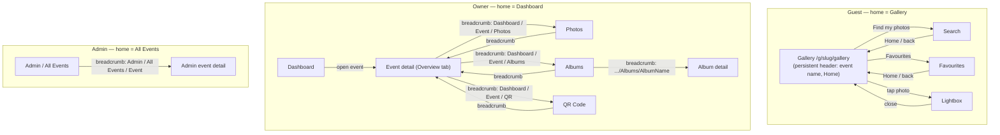

## Context

Reported problem: *"the UI of different pages is not in sync with each other. Navigation is very random. As a user it's very hard."*

This session investigates why navigation feels random by tracing, page by page, how a user gets back to where they came from. It found the cause isn't visual polish — it's that **every section of the app invented its own back-navigation idiom independently**, and one path actively ejects guests from their event. This document defines a single consistent navigation model to replace the ad-hoc ones. It applies across all three user types already described in `docs/features/product-ux/ux.md`:

- **Guests** — no account, arrive via QR/link, browse `/g/[slug]/...`.
- **Photographers / event owners** — manage events under `/events/[eventId]/...`, from `/dashboard`.
- **Platform admins** — `/admin/...`.

This is a navigation/IA fix, not a visual redesign — colors, spacing, and typography are out of scope (see below).

---

## Diagnosis — what's actually happening today

Three unrelated navigation idioms coexist for pages that are conceptually one hop apart:

| Idiom | Where used | Example |
|---|---|---|
| Arrow-prefixed single link | Event detail, Admin event detail | `← Dashboard` |
| Full breadcrumb chain | Photos, Albums, Album detail, QR | `Dashboard / {Event name} / Photos` |
| Bespoke per-page buttons | Guest gallery, search, favourites | pill buttons, icon-link, plain text link — three different styles, three different pages |

None of this is enforced by a shared component — there is exactly one shared nav element in the whole codebase (`components/Nav.tsx`, the top logo bar), and no breadcrumb component at all. Every "back to X" link below it was written by hand, per page.

**The most serious break:** the global `Nav` (logo + Login/Register/Dashboard links) renders on *every* route, including guest pages under `/g/[slug]/...` (`app/g/layout.tsx` doesn't suppress it). Guests never have an account, so `isAuthenticated()` is false for them — which means the "WeddingLens" logo in their header links to `/`, and `/` (`app/page.tsx`) redirects anyone not authenticated straight to **`/login`**. A guest who taps the logo — the single most natural "take me home" gesture in any app — is bounced out of their wedding gallery onto a photographer login form. This is very likely the concrete thing driving "navigation is very random": the one global, always-visible nav element does the *opposite* of what a guest expects, while it's the *only* consistent thing on the page.

Two smaller breaks compound it:
- Guest pages have no way back to the PIN/landing page (`/g/[slug]`) — not a bug worth fixing (re-entering a code is worse UX than just going to Gallery), but it means **Gallery, not the landing page, is the guest's real "home."** Nothing currently treats it that way.
- `events/new`'s Cancel button uses `router.back()` instead of a fixed link — if an owner opens "New Event" from a bookmark or refresh (no history), Cancel can land somewhere unrelated to Dashboard.

---

## Primary flow — target navigation model

One rule per persona, applied everywhere, with a single always-visible "home" affordance that never contradicts itself:

**Rules this enforces:**

1. **Global logo behavior is persona-aware.** For a logged-in owner/admin it goes to their home (Dashboard/Admin). For a guest, the global marketing Nav is **not shown at all** — guest routes get their own lightweight header (event name + a single "Home" control that always means Gallery), never the Login/Register bar. A guest should never see an affordance whose destination is a page they have no way to use.
2. **One breadcrumb idiom, used everywhere an owner or admin is more than one hop from their home.** `Dashboard / {Event name} / {Page}` for owner pages, `Admin / All Events / {Event name}` for admin. The event-detail page's current arrow-link + separate "Quick links" row collapses into this same breadcrumb — Photos/Albums/QR become tabs or a persistent sub-nav on the event, not a one-off row unique to that screen.
3. **Every "back" control is a real link (`href`), never `router.back()`.** So it works the same whether the user navigated forward normally or arrived via a bookmark/refresh/shared URL.
4. **Guest's back-navigation always targets Gallery**, styled identically (one component) on Search, Favourites, and the Lightbox — not three different visual treatments for the same action.

---

## Screen / component inventory

| Screen or component | Current back-nav | Target back-nav | Entry points | Exit points |
|---|---|---|---|---|
| `components/Nav.tsx` (global) | Renders unconditionally, incl. on guest routes; logo → `/` → `/login` for anyone unauthenticated | Suppressed on `/g/[slug]/...`; logo → persona home elsewhere | n/a | Dashboard / Login / Admin |
| `/events/[eventId]` (event detail) | Arrow link `← Dashboard` + separate "Quick links" row | Breadcrumb `Dashboard / {Event}`; Photos/Albums/QR become tabs/sub-nav, not a bespoke row | Dashboard | Photos, Albums, QR |
| `/events/[eventId]/photos` | Breadcrumb `Dashboard / {Event} / Photos` | Unchanged — already the target pattern | Event detail | back via breadcrumb |
| `/events/[eventId]/albums` | Breadcrumb, matches photos | Unchanged | Event detail | Album detail |
| `/events/[eventId]/albums/[albumId]` | Breadcrumb; **error state is the outlier**, links "Back to Albums" instead of Dashboard like every other page's error fallback | Standardize error-state fallback to breadcrumb's own parent, consistently, on every page (not just this one) | Albums list | Albums list |
| `/events/[eventId]/qr` | Breadcrumb, matches photos/albums | Unchanged | Event detail | — |
| `/events/new` | No breadcrumb; Cancel uses `router.back()` | Add `Dashboard / New Event`; Cancel → fixed `href="/dashboard"` | Dashboard | Event detail |
| `/dashboard` | None (top-level, correct) | Unchanged | Nav, login | Event detail, new event |
| `/admin` | None (top-level, correct) | Unchanged | Nav (admin only) | Admin event detail |
| `/admin/events/[eventId]` | Arrow link `← Admin — All Events` | Keep arrow-or-breadcrumb but make it the **same** component/style as owner breadcrumbs, just rooted at Admin | Admin list | Admin list |
| `/g/[slug]` (PIN/landing) | n/a (entry point) | Unchanged; no longer the guest's implied "home" — Gallery is | QR, shared link | Gallery |
| `/g/[slug]/gallery` | Bespoke header, pill buttons, no way back to landing (fine) | Becomes guest's persistent home header: event name + Find my photos + Favourites, used as the anchor everything else returns to | Landing, Search, Favourites, Lightbox | Search, Favourites, Lightbox |
| `/g/[slug]/search` | Icon-link "Back to gallery" | Same control, shared component with Favourites | Gallery | Gallery, results |
| `/g/[slug]/favourites` | Two different text links to gallery | Single shared "Home" control, same as Search | Gallery | Gallery |

---

## Edge cases and error states

| Condition | What the user sees today | What should happen |
|---|---|---|
| Guest taps the logo/home affordance from Gallery, Search, or Favourites | Sent to `/` → redirected to `/login` (photographer login form) | Guest-side pages don't render the global Nav at all; their "Home" always resolves to Gallery |
| Owner opens `/events/new` via bookmark/refresh (no browser history) and clicks Cancel | `router.back()` can land anywhere or nowhere | Cancel is a fixed link to `/dashboard` |
| Owner/admin hits an error state on a nested page (album detail, photos, etc.) | Inconsistent fallback target — most say "Back to Dashboard," album detail says "Back to Albums" | Standardize: error fallback always matches that page's breadcrumb parent, applied uniformly |
| Owner is one level deep (e.g. Photos) and wants to jump sideways to Albums or QR without returning to Event detail first | Not possible — only event-detail page has the "Quick links" row | Persistent sub-nav/tabs on all event-scoped pages, not just the parent |
| Guest is deep in Search or Favourites and wants back to Gallery | Three different visual treatments depending which page they're on | One shared component, same placement and style everywhere |

---

## Open questions

- [ ] Should the owner-side breadcrumb become a real shared component now, or is a scoped pass (fixing the specific inconsistencies listed above) enough for this iteration? — owner: engineering
- [ ] Should Photos/Albums/QR become tabs *within* the event-detail page (extending the existing Overview/Publish & Access/Photographers/Danger Zone tab set) or remain separate routes with a shared sub-nav bar? Affects whether this is a routing change or a component-only change. — owner: engineering
- [ ] For the admin event-detail breadcrumb, should it visually match the owner-side breadcrumb exactly (shared component) or stay visually distinct to signal "you are in admin space"? — owner: product
- [ ] Confirm: is Gallery the intended guest "home," or should there be an explicit way back to the PIN/landing page (e.g. a guest wants to re-enter with a different code)? — owner: product

---

## Out of scope

- Visual/pixel-level design (colors, spacing, typography) — this is IA and navigation-consistency only.
- The unrelated friction items already logged in `docs/features/product-ux/ux.md` (silent download failures, one-at-a-time album assignment, SSE reconnect indicator, etc.) — not touched here.
- Backend/auth changes — this doc assumes `isAuthenticated()`/guest-session behavior stays as-is; only what renders around it changes.
- Mobile-specific nav patterns (e.g. bottom tab bar) — not raised by the reported problem, not addressed here.
