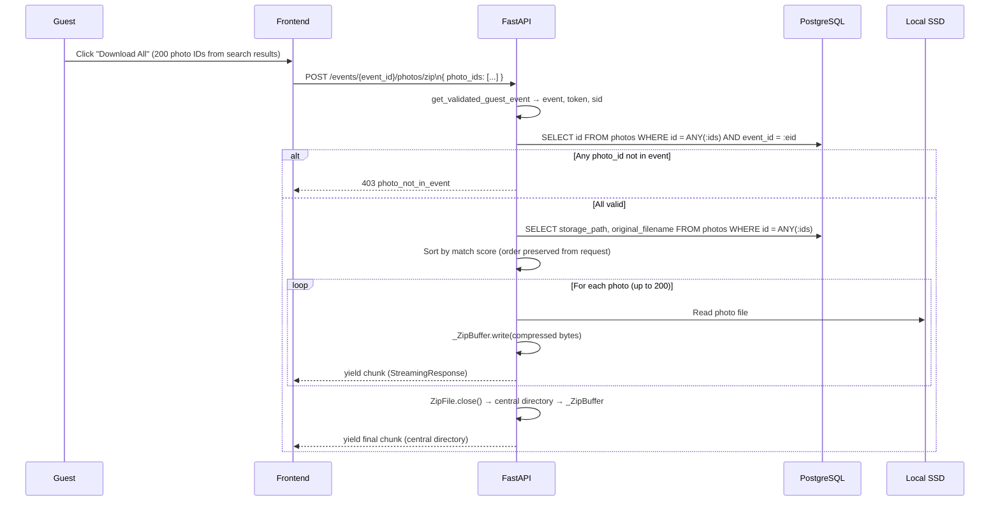
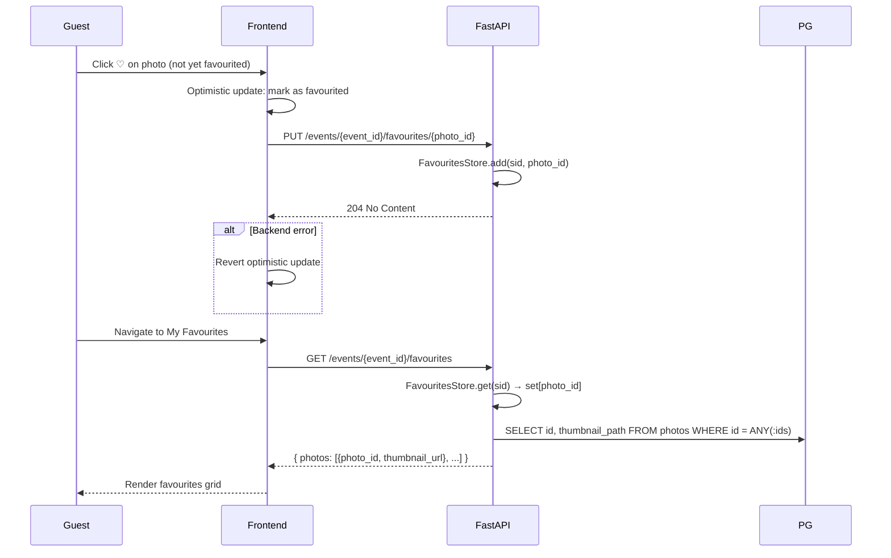

# Photo Actions — Design

**Status:** Ready for build
**Author:** Engineering
**Date:** 2026-06-20
**Epic:** [docs/epics/photo-actions/EPIC.md](../../epics/photo-actions/EPIC.md)
**Requirements:** [requirements.md](./requirements.md)

---

## Problem Statement

Guests need to download individual or bulk sets of their photos, generate event-scoped shareable links, and maintain a personal favourites list — all without a user account. The system is stateless-JWT-based with no Redis or distributed session store. Solutions must fit within the single-VM, in-process architecture.

---

## Consistency Note

The album-gallery design (`docs/features/album-gallery/design.md`) already defines `GET /api/v1/events/{event_id}/photos/{photo_id}/download` with `Content-Disposition: attachment` and `download_count` increment. Photo-actions reuses this endpoint verbatim — no duplicate is created. The photo-actions requirement "downloading from the album browse view is out of scope" refers to the UI surface (the download button is not shown in the album grid), not the underlying endpoint. **Both features call the same endpoint.**

Photo-actions depends on album-gallery's Migration 004 which adds `download_count`, `is_photographer_choice`, and `thumbnail_path` to the `photos` table.

---

## Decisions

### Decision 1 — Favourite state: in-process `FavouritesStore` singleton

**Chosen:** In-process `dict[sid → set[photo_id]]` with a 24h TTL, consistent with the `SearchCache` and `GuestRateLimiter` patterns already in the codebase.

See ADR: [2026-06-20-favourites-in-process-store.md](../../decisions/2026-06-20-favourites-in-process-store.md)

Key implications:
- Three new endpoints expose CRUD over the store (`GET`, `PUT`, `DELETE /favourites`).
- The frontend calls `GET /favourites` on the My Favourites page mount to hydrate state. Favourite toggles on the search results page update state optimistically in the frontend and persist to the store via `PUT`/`DELETE`.
- `sid` is extracted from `get_validated_guest_event` (already returns `tuple[Event, str, str]` — event, refreshed_token, sid).
- State lost on server restart is acceptable for MVP.

### Decision 2 — Shareable link format: JWT with `type: share` claim

**Chosen:** JWT signed with `SECRET_KEY`, discriminated by `"type": "share"`. Standard 72h fixed expiry via `exp` claim.

See ADR: [2026-06-20-share-token-jwt.md](../../decisions/2026-06-20-share-token-jwt.md)

Key implications:
- `create_share_token(photo_id, event_id) → str` and `decode_share_token(token) → dict` are added to `app/services/guest_auth.py`.
- `decode_share_token` raises `HTTPException(403, "link_expired")` when `exp` is past and `HTTPException(403, "invalid_share_token")` for bad signatures or wrong `type`.
- A separate `GET /api/v1/share/{token}` endpoint (no guest auth required) validates the token and returns `{photo_id, event_id, event_slug}`.

### Decision 3 — ZIP streaming: `zipfile` with `_ZipBuffer`

**Chosen:** Python stdlib `zipfile.ZipFile` writing to a custom `_ZipBuffer` wrapper. Files are written one at a time; compressed bytes are yielded to `StreamingResponse` after each file. The ZIP central directory (small, O(num files)) is buffered and yielded on `ZipFile.close()`.

Peak memory per request: max(single compressed photo size) + central directory (a few KB for 200 entries). Total archive size does not accumulate in memory.

```
_ZipBuffer tracks:
  _total_written: int          # running byte offset — used by zipfile for correct central directory offsets
  _pending: bytearray          # bytes written since last pop()

def pop() → bytes:             # called after each zf.write(); yields to StreamingResponse
    data = bytes(self._pending)
    self._pending.clear()
    return data
```

Applied identically to the face-search ZIP (`POST /photos/zip`) and the favourites ZIP (`POST /favourites/zip`). Shared via `app/services/zip_streaming.py`.

---

## API Design

Seven net-new endpoints. All guest endpoints use `get_validated_guest_event` and return `X-Guest-Token` for sliding refresh.

```
# Reused from album-gallery (no change)
GET    /api/v1/events/{event_id}/photos/{photo_id}/download

# New — photo_actions router (app/routers/photo_actions.py)
POST   /api/v1/events/{event_id}/photos/zip
POST   /api/v1/events/{event_id}/photos/{photo_id}/share

# New — favourites (same router)
GET    /api/v1/events/{event_id}/favourites
PUT    /api/v1/events/{event_id}/favourites/{photo_id}
DELETE /api/v1/events/{event_id}/favourites/{photo_id}
POST   /api/v1/events/{event_id}/favourites/zip

# New — share resolver (app/routers/share.py, no guest auth)
GET    /api/v1/share/{token}
```

### POST /photos/zip — face-search bulk download

```
POST /api/v1/events/{event_id}/photos/zip
Authorization: Bearer <guest_token>
Content-Type: application/json

{ "photo_ids": ["uuid", ...] }   ← up to 200; client passes the face-search result IDs
```

Response:
```
HTTP 200
Content-Type: application/zip
Content-Disposition: attachment; filename="wedding-{event-slug}-my-photos.zip"
X-Guest-Token: <refreshed>

<streaming ZIP bytes>
```

Errors:

| HTTP | `detail` | Condition |
|------|----------|-----------|
| 400 | `"photo_ids_required"` | Empty list |
| 403 | `"photo_not_in_event"` | Any `photo_id` belongs to a different `event_id` |
| 401 | `"Invalid or expired guest token"` | Bad/expired JWT |

Backend validates all `photo_ids` belong to `event_id` in a single `SELECT id FROM photos WHERE id = ANY(:ids) AND event_id = :event_id` query before streaming begins. If count of returned rows ≠ len(photo_ids), reject with 403.

### POST /photos/{photo_id}/share — generate share token

```
POST /api/v1/events/{event_id}/photos/{photo_id}/share
Authorization: Bearer <guest_token>
```

Response:
```json
HTTP 201
X-Guest-Token: <refreshed>

{
  "share_url": "https://{APP_HOST}/share/{token}",
  "expires_at": "2026-06-22T14:30:00Z"
}
```

`APP_HOST` is read from a new `NEXT_PUBLIC_APP_URL` env var on the backend (already declared in CLAUDE.md). Backend constructs the full URL so the client does not need to know the token format.

### GET /share/{token} — validate share token (public endpoint, no auth)

```
GET /api/v1/share/{token}
```

Response — valid token:
```json
HTTP 200
{
  "photo_id": "uuid",
  "event_id": "uuid",
  "event_slug": "smith-jones-2026"
}
```

Response — expired:
```json
HTTP 410
{ "detail": "link_expired" }
```

Response — invalid:
```json
HTTP 403
{ "detail": "invalid_share_token" }
```

### GET /favourites — list favourited photo IDs + metadata

```
GET /api/v1/events/{event_id}/favourites
Authorization: Bearer <guest_token>
```

Response:
```json
HTTP 200
X-Guest-Token: <refreshed>

{
  "photos": [
    { "photo_id": "uuid", "thumbnail_url": "/api/v1/events/{id}/photos/{id}/thumbnail" }
  ]
}
```

Backend reads `FavouritesStore.get(sid)` → set of `photo_id` strings → queries PostgreSQL for `thumbnail_path` → builds response. Empty set returns `{ "photos": [] }`.

### PUT /favourites/{photo_id} — add to favourites

```
PUT /api/v1/events/{event_id}/favourites/{photo_id}
Authorization: Bearer <guest_token>
```

Response: `204 No Content` + `X-Guest-Token`. Idempotent — adding an already-favourited photo is a no-op.

Backend validates `photo_id` belongs to `event_id` before adding to the store (single `SELECT 1` existence check).

### DELETE /favourites/{photo_id} — remove from favourites

```
DELETE /api/v1/events/{event_id}/favourites/{photo_id}
Authorization: Bearer <guest_token>
```

Response: `204 No Content` + `X-Guest-Token`. Idempotent — removing a non-favourited photo is a no-op.

### POST /favourites/zip — bulk download favourites

```
POST /api/v1/events/{event_id}/favourites/zip
Authorization: Bearer <guest_token>
```

No request body — backend derives photo list from `FavouritesStore.get(sid)`.

Response:
```
HTTP 200
Content-Type: application/zip
Content-Disposition: attachment; filename="wedding-{event-slug}-my-favourites.zip"
X-Guest-Token: <refreshed>

<streaming ZIP bytes>
```

Returns `400 { "detail": "no_favourites" }` if the favourites set is empty (REQ-29).

Note on routing: `PUT /favourites/{photo_id}` uses `photo_id: uuid.UUID` type annotation. FastAPI's UUID path converter will not match the literal string `"zip"`, so `POST /favourites/zip` and `DELETE /favourites/{photo_id: uuid.UUID}` coexist without conflict.

---

## Sequence Diagrams

### Bulk ZIP download (face-search results)



### Shareable link — generation and recipient flow

```mermaid
sequenceDiagram
    participant G as Guest
    participant R as Recipient
    participant FE as Frontend
    participant BE as FastAPI

    G->>FE: Click "Share" on photo
    FE->>BE: POST /events/{event_id}/photos/{photo_id}/share
    BE->>BE: create_share_token(photo_id, event_id, exp=now+72h)
    BE-->>FE: { share_url, expires_at }
    FE->>FE: Copy share_url to clipboard; show "Link copied!" toast

    R->>FE: Open /share/{token}
    FE->>BE: GET /api/v1/share/{token}
    alt Token expired
        BE-->>FE: 410 link_expired
        FE-->>R: Expired link page + event homepage link
    else Token valid
        BE-->>FE: { photo_id, event_id, event_slug }
        alt Guest already authenticated for event
            FE-->>R: Shared photo view
        else Not authenticated
            FE->>FE: Redirect to /g/{event_slug}?next=/share/{token}
            R->>FE: Complete event auth (access code / OTP / public: no gate)
            FE-->>R: Redirect back to /share/{token} → shared photo view
        end
    end
```

### Favourite toggle and My Favourites page



---

## Backend Design

### New files

#### `app/services/zip_streaming.py`

```
generate_zip_stream(photos: list[Photo]) -> Iterator[bytes]
```

Uses `_ZipBuffer` (custom `io.RawIOBase` subclass) as the write target for `zipfile.ZipFile`. After each `zf.write(storage_path, arcname=original_filename)`, calls `buf.pop()` and yields the bytes. After `ZipFile.close()`, yields final `buf.pop()` (central directory).

`ZIP_DEFLATED` compression. Each photo file is read synchronously from SSD inside the generator — this runs in FastAPI's thread pool via `StreamingResponse`.

#### `app/services/favourites_store.py`

Module-level singleton `FavouritesStore`:

```
get(sid: str) -> set[str]           # returns photo_ids; empty set if no entry
add(sid: str, photo_id: str) -> None
remove(sid: str, photo_id: str) -> None
_evict() -> None                    # called on every get/add/remove; removes entries
                                    # where last_accessed > GUEST_SESSION_IDLE_TTL_SECONDS
```

Backed by `dict[str, tuple[set[str], datetime]]` (sid → (photo_ids, last_accessed)). `last_accessed` is updated on every `get`, `add`, or `remove` — implements sliding TTL matching the guest session window.

#### `app/routers/photo_actions.py`

Registers all new guest-authenticated endpoints under the `/api/v1/events/{event_id}/` prefix. Router tag: `photo-actions`.

#### `app/routers/share.py`

Single public endpoint `GET /api/v1/share/{token}`. No `get_validated_guest_event` dependency. Calls `decode_share_token(token)` and returns photo/event info or raises 410/403.

### Modified files

#### `app/services/guest_auth.py` — add share token functions

```python
def create_share_token(photo_id: str, event_id: str) -> str:
    payload = {
        "type": "share",
        "sub": event_id,
        "photo_id": photo_id,
        "exp": utcnow() + timedelta(hours=72),
        "iat": utcnow(),
    }
    return jwt.encode(payload, settings.SECRET_KEY, algorithm=settings.ALGORITHM)

def decode_share_token(token: str) -> dict:
    # Raises HTTPException(410) on expired, HTTPException(403) on invalid/wrong type
```

#### `app/main.py`

Register `photo_actions.router` and `share.router`.

#### `app/config.py`

```python
APP_HOST: str  # used to construct share_url in POST /share response
```

---

## Frontend Design

### New pages

#### `app/share/[token]/page.tsx` — shared photo page

Server component that:
1. Calls `GET /api/v1/share/{token}` (no auth)
2. If `410` or `403`: renders `<ExpiredLinkPage eventSlug={...} />`
3. If valid: checks if guest is authenticated for `event_id` (reads from localStorage)
   - Authenticated: renders `<SharedPhotoView photoId={...} eventId={...} />`
   - Not authenticated: redirects to `/g/{event_slug}?next=/share/{token}`

#### `app/g/[slug]/favourites/page.tsx` — My Favourites page

Calls `GET /favourites` on mount via `useFavourites` hook. Renders `<PhotoGrid>` with same download + share actions as search results. Shows `<FavouritesEmptyState />` when `photos.length === 0`. Includes `<BulkDownloadButton source="favourites" />`.

### New components and hooks

#### `useFavourites(eventId)` hook

```typescript
{
  favouriteIds: Set<string>
  isFavourited: (photoId: string) => boolean
  toggle: (photoId: string) => Promise<void>   // optimistic update + PUT/DELETE
  isLoading: boolean
}
```

Initialises by calling `GET /favourites` on mount. Provides `toggle` which:
1. Optimistically updates local `Set<string>`
2. Calls `PUT` (add) or `DELETE` (remove) against backend
3. On error: reverts local state and surfaces toast

Mounted at the search results page level so toggle state is shared between the photo grid and any open lightbox.

#### `FavouriteToggle` component

Heart icon button. Reads `isFavourited(photoId)` from `useFavourites` context. Calls `toggle(photoId)` on click. Animated state change (filled ↔ outline) without page reload (REQ-19, AC-16/AC-17).

#### `ShareButton` component

On click: calls `POST /events/{event_id}/photos/{photo_id}/share`, receives `share_url`, copies to clipboard via `navigator.clipboard.writeText`, shows "Link copied!" toast. Shows `expires_at` in the toast for user awareness.

#### `BulkDownloadButton` component

Props: `source: "search" | "favourites"`, `photoIds?: string[]` (required for `source="search"`).

- `source="search"`: `POST /photos/zip` with `{ photo_ids }`. Shows 200-photo cap notice if `photoIds.length > 200` (client-side pre-check before triggering request; backend enforces the cap independently).
- `source="favourites"`: `POST /favourites/zip` (no body). Hidden/disabled when `favouriteIds.size === 0`.

Triggers browser download via a blob URL or by following the streaming response.

#### `ExpiredLinkPage` component

Renders: "This link has expired." + link to event homepage (`/g/{event_slug}`). No photo content, no photo ID in the DOM (REQ-18).

---

## Constraints Satisfied

| Constraint | How |
|------------|-----|
| Frontend talks only to backend | All photo/ZIP/share requests go to `/api/v1/` — no direct SSD or DB access from frontend |
| Backend owns all data stores | `FavouritesStore`, file streaming, and DB queries are backend-only |
| Searches scoped per `event_id` | Every endpoint validates `event_id` from the guest JWT `sub` claim before serving any file |
| No face data exposed | Photo-actions endpoints serve photo files and metadata only — no embeddings or selfie data |
| Face processing async | Not applicable — photo-actions does not trigger face processing |

---

## Build Tasks

**Backend:**
1. Add `APP_HOST` to `app/config.py`
2. Add `create_share_token` and `decode_share_token` to `app/services/guest_auth.py`
3. Create `app/services/zip_streaming.py` — `_ZipBuffer` + `generate_zip_stream`
4. Create `app/services/favourites_store.py` — `FavouritesStore` singleton
5. Create `app/routers/photo_actions.py` — `POST /photos/zip`, `POST /photos/{id}/share`, `GET/PUT/DELETE/POST /favourites/*`
6. Create `app/routers/share.py` — `GET /share/{token}`
7. Register both routers in `app/main.py`
8. Tests: ZIP validation (cross-event photo rejected), ZIP streaming (no full-buffer in memory), share token expiry, favourites add/remove/list, favourites ZIP with empty set returns 400, public event share link skips auth gate

**Frontend:**
1. `useFavourites(eventId)` hook with optimistic toggle
2. `FavouriteToggle` component
3. `ShareButton` component (clipboard + toast)
4. `BulkDownloadButton` component (search + favourites variants)
5. `ExpiredLinkPage` component
6. `app/share/[token]/page.tsx` — share link landing page
7. `app/g/[slug]/favourites/page.tsx` — My Favourites page
8. Wire `FavouriteToggle` and `ShareButton` into existing search results photo cards
9. Wire `BulkDownloadButton` into search results page
10. Handle `?next=/share/{token}` redirect after event auth

---

## Open Questions

None — all functional questions resolved during grooming. The two ADRs (share token JWT, FavouritesStore pattern) document the key design decisions.
