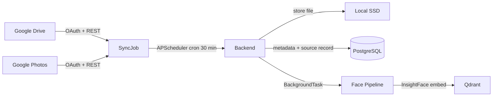

## Epic
docs/epics/photo-source-integration/EPIC.md

## Purpose
Allow photographers to connect a Google Drive folder or Google Photos album to an event so that photos are automatically imported, thumbnailed, and indexed via the existing face processing pipeline — eliminating the need to manually upload photos that already exist in cloud sources.

## Scenarios in scope
1. Photographer connects a Google Drive folder to an event — OAuth flow completes, initial sync runs, photos imported
2. Photographer connects a Google Photos album to an event — OAuth flow completes, initial sync runs, photos imported
3. Scheduled re-sync detects new photos added to the connected source since last sync — only new photos imported (existing skipped by source file ID)
4. Sync encounters a file in an unsupported format (e.g. HEIC, RAW) — file skipped with a warning logged; other files in the batch continue
5. Sync encounters a file exceeding 25 MB — file skipped with a warning; other files continue
6. OAuth token expires during sync — sync pauses, photographer sees a reconnect prompt on dashboard; re-connecting resumes from last successful import
7. Photographer views sync progress on dashboard (counts and status per event)
8. Photographer disconnects a source — future syncs stop; already-imported photos remain

## User stories / use cases

### Scenario 1 — Google Drive connection
- As a photographer, I want to link a Google Drive folder to my event via OAuth, so that photos I already have in Drive are automatically imported without manual upload.

### Scenario 2 — Google Photos connection
- As a photographer, I want to link a Google Photos album to my event via OAuth, so that photos shared to that album are imported automatically.

### Scenario 3 — Incremental re-sync
- As a photographer, I want the system to check my connected source every 30 minutes and import any new photos added since the last sync, so that guests always see the latest photos without me taking any action.

### Scenario 4 — Unsupported format handling
- As a photographer, I want unsupported file formats (HEIC, RAW) to be skipped with a clear log entry, so that one bad file does not block the rest of the batch.

### Scenario 5 — Oversized file handling
- As a photographer, I want files over 25 MB to be skipped with a visible warning, so that the sync continues for the rest of the photos.

### Scenario 6 — OAuth token expiry and reconnect
- As a photographer, I want to be prompted to reconnect my Google account when my OAuth token cannot be refreshed, so that I know why new photos have stopped syncing and can fix it.

### Scenario 7 — Sync progress visibility
- As a photographer, I want to see how many photos were found, imported, currently processing, and failed for each event source, so that I know when the gallery is ready for guests.

### Scenario 8 — Source disconnection
- As a photographer, I want to disconnect a photo source from an event, so that no further syncs run against it while keeping all already-imported photos visible to guests.

## Functional requirements

### Scenario 1 — Google Drive connection
1. REQ-1 (Scenario 1): The photographer dashboard must provide a "Connect Google Drive" action scoped to a specific event, initiating a Google OAuth 2.0 authorization code flow that requests the `drive.readonly` scope.
2. REQ-2 (Scenario 1): On successful OAuth completion, the backend must store the encrypted access token, refresh token, token expiry, and the selected folder ID against the event record in PostgreSQL.
3. REQ-3 (Scenario 1): Immediately after a source is connected, the backend must trigger an initial sync run that downloads all JPEG and PNG files from the linked folder and feeds them into the face processing pipeline.
4. REQ-4 (Scenario 1): Each imported photo must be stored on the local SSD and recorded in PostgreSQL with its source type (`google_drive`), source file ID (Google Drive file ID), event_id, and import timestamp.

### Scenario 2 — Google Photos connection
5. REQ-5 (Scenario 2): The photographer dashboard must provide a "Connect Google Photos" action scoped to a specific event, initiating a Google OAuth 2.0 authorization code flow that requests the `photoslibrary.readonly` scope.
6. REQ-6 (Scenario 2): On successful OAuth completion, the backend must store the encrypted access token, refresh token, token expiry, and the selected album ID against the event record in PostgreSQL.
7. REQ-7 (Scenario 2): Immediately after a source is connected, the backend must trigger an initial sync run that downloads all JPEG and PNG media items from the linked album and feeds them into the face processing pipeline.
8. REQ-8 (Scenario 2): Each imported photo must be recorded in PostgreSQL with its source type (`google_photos`), source media item ID (Google Photos media ID), event_id, and import timestamp.

### Scenario 3 — Incremental re-sync
9. REQ-9 (Scenario 3): APScheduler must run a sync job for every active (connected, non-paused) event source on a 30-minute cron schedule.
10. REQ-10 (Scenario 3): Each sync run must query the source for items created or modified after the `last_synced_at` timestamp stored against the source connection.
11. REQ-11 (Scenario 3): Before downloading a file, the backend must check whether a photo with the same source file ID already exists for the event. If a match is found, the file must be skipped — no download, no duplicate record created.
12. REQ-12 (Scenario 3): After a successful sync run, the backend must update `last_synced_at` on the source connection record to the sync start timestamp.
13. REQ-13 (Scenario 3): Sync jobs must be idempotent — if a sync run is interrupted and retried, no duplicate photo records may be created.

### Scenario 4 — Unsupported format handling
14. REQ-14 (Scenario 4): During a sync run, any file whose MIME type is not `image/jpeg` or `image/png` must be skipped without downloading.
15. REQ-15 (Scenario 4): Each skipped file must be logged at WARNING level with the source file ID, detected MIME type, and event_id. The skip must not abort the sync run; remaining files in the batch must continue.

### Scenario 5 — Oversized file handling
16. REQ-16 (Scenario 5): During a sync run, any file whose declared size (from the source API metadata) exceeds 25 MB must be skipped without downloading.
17. REQ-17 (Scenario 5): Each skipped oversized file must be logged at WARNING level with the source file ID, file size, and event_id. The skip must not abort the sync run.

### Scenario 6 — OAuth token expiry and reconnect
18. REQ-18 (Scenario 6): The backend must use the Google OAuth SDK's automatic token refresh before each API call; if the refresh succeeds, the sync run continues without interruption.
19. REQ-19 (Scenario 6): If the token refresh fails (e.g. token revoked, offline), the backend must set the source connection status to `auth_error`, record the failure timestamp, and halt the sync run for that source without affecting other sources.
20. REQ-20 (Scenario 6): While a source is in `auth_error` status, the photographer dashboard must display a "Reconnect" prompt for that event source. No further scheduled sync runs must be attempted for that source until it is reconnected.
21. REQ-21 (Scenario 6): When the photographer completes a fresh OAuth flow for an `auth_error` source, the backend must update the stored tokens, set the status back to `active`, and trigger a sync run starting from `last_synced_at` — photos already imported before the auth failure must not be re-imported.

### Scenario 7 — Sync progress visibility
22. REQ-22 (Scenario 7): The photographer dashboard must display the following counts per connected event source: photos found in source, photos imported to local storage, photos queued for or undergoing face processing, photos successfully face-indexed, photos failed (format/size skip or face processing error).
23. REQ-23 (Scenario 7): Dashboard counts must reflect the current state within 5 seconds of any change — the update mechanism (polling or SSE) is a design decision.
24. REQ-24 (Scenario 7): The dashboard must show the last successful sync timestamp and the current source status (`active`, `auth_error`, `disconnected`) for each connected source.

### Scenario 8 — Source disconnection
25. REQ-25 (Scenario 8): The photographer dashboard must provide a "Disconnect" action per connected event source.
26. REQ-26 (Scenario 8): On disconnection, the backend must set the source connection status to `disconnected` and revoke or discard the stored OAuth tokens. No further scheduled sync runs must be triggered for that source.
27. REQ-27 (Scenario 8): Disconnecting a source must not delete or alter any photos that were already imported from that source — those photos remain in the event and visible to guests.

## Non-functional requirements
- NFR-1: A single sync run must not download more photos than a configurable batch limit (maximum per sync run TBD by Engineering) to avoid saturating the face pipeline or disk I/O.
- NFR-2: OAuth tokens must be encrypted at rest in PostgreSQL using the same encryption approach as face embeddings.
- NFR-3: A sync run for a source with 1,000 new photos must complete without crashing or exhausting available disk, assuming sufficient free space exists on the SSD.
- NFR-4: Sync jobs must not run concurrently for the same source — if a previous run is still in progress when the scheduler fires, the new run must be skipped until the next cycle.
- NFR-5: Imported photos must enter the face processing pipeline via the same `BackgroundTask` path as manually uploaded photos — sync must never block on face processing.
- NFR-6: Searches remain scoped per `event_id` — photo source integration must not introduce cross-event leakage in Qdrant or PostgreSQL.

## Context

### Architecture fit

- APScheduler runs inside the FastAPI process (single-VM deployment). Each source has one scheduled job identified by `source_connection_id`.
- Sync jobs call the same internal service layer as manual uploads — the face processing `BackgroundTask` is enqueued identically.
- Photographer authentication uses email + password JWT (ADR: `docs/decisions/2026-06-19-photographer-auth-email-password.md`). The Google OAuth flow for Drive/Photos is a separate, additional authorization for the source APIs — it is not the photographer's login mechanism.
- One photographer may have connected sources across multiple events they are assigned to; each event has its own independent source connection record and sync schedule.
- A single event may have at most one Google Drive connection and at most one Google Photos connection at a time.

### Data model additions (indicative)
A `photo_source_connections` table is needed in PostgreSQL with at minimum: `id`, `event_id`, `source_type` (`google_drive` | `google_photos`), `source_folder_or_album_id`, `status` (`active` | `auth_error` | `disconnected`), `encrypted_access_token`, `encrypted_refresh_token`, `token_expiry`, `last_synced_at`, `created_at`.

Photos imported via sync must carry `source_type` and `source_file_id` columns (on the existing `photos` table or a linked `photo_sources` table) to support duplicate detection.

## Out of scope
- S3, Amazon S3, Azure Blob Storage, and web server/CDN URL import (deferred to a future phase)
- HEIC and RAW file format support
- Webhook-triggered sync (scheduled cron only in this feature)
- Cross-photographer source sharing (one photographer connection per source per event)
- Automatic photo selection or filtering from the source — all photos in the linked folder or album are candidates for import
- Deletion propagation — if a photo is deleted from Google Drive or Google Photos, the imported copy in WeddingLens is not automatically deleted (open question — see below)
- Photographer notification (email or in-app) on sync completion or failure (open question — see below)
- Photographer account registration and password reset (Auth feature)
- Guest-facing gallery changes specific to this feature

## Open questions
- [ ] Should Google Drive and Google Photos use separate OAuth apps (separate client IDs) or a single Google OAuth client? — owner: Engineering
- [ ] When a photo is deleted from Google Drive/Photos, should WeddingLens also delete the imported copy? — owner: Product Team
- [ ] Should the photographer be notified (email or in-app) when a sync completes or fails? — owner: Product Team
- [ ] What is the maximum number of photos per sync run to avoid overloading the face pipeline? — owner: Engineering

## Acceptance criteria
- AC-1 (Scenario 1): A photographer clicks "Connect Google Drive" on an event, completes the Google OAuth consent screen, selects a folder, and is redirected back to the dashboard; within 60 seconds the dashboard shows photos from that folder appearing in the imported count and entering face processing.
- AC-1b (Scenario 1): The backend stores a source connection record in PostgreSQL with source type `google_drive`, the folder ID, and encrypted tokens; the photographer's event page reflects the connected source.
- AC-2 (Scenario 2): A photographer clicks "Connect Google Photos" on an event, completes the Google OAuth consent screen, selects an album, and is redirected back to the dashboard; within 60 seconds photos from that album appear in the imported count and enter face processing.
- AC-2b (Scenario 2): The backend stores a source connection record in PostgreSQL with source type `google_photos`, the album ID, and encrypted tokens.
- AC-3 (Scenario 3): A photographer adds a new JPEG to a connected Google Drive folder; within 35 minutes (one scheduler cycle) the photo appears in the dashboard imported count and is enqueued for face processing — no existing photo records are duplicated.
- AC-3b (Scenario 3): Running a sync against a source whose photos have all been previously imported produces zero new photo records and zero new face-processing jobs.
- AC-4 (Scenario 4): A connected Google Drive folder contains one JPEG and one HEIC file; after sync, only the JPEG is imported; the HEIC is absent from the photo list; a WARNING log entry exists for the HEIC file referencing its source file ID and event_id.
- AC-5 (Scenario 5): A connected folder contains one 10 MB JPEG and one 30 MB JPEG; after sync, only the 10 MB file is imported; a WARNING log entry exists for the 30 MB file; the sync run completes without error.
- AC-6 (Scenario 6): During a sync run, the OAuth refresh token is revoked; the sync halts for that source, the source status is set to `auth_error`, and the photographer dashboard displays a "Reconnect" prompt for the affected event.
- AC-6b (Scenario 6): After the photographer completes a fresh OAuth flow, the source status returns to `active`, a new sync run starts from `last_synced_at`, and photos imported before the auth failure are not duplicated.
- AC-7 (Scenario 7): The photographer dashboard shows separate counts for found, imported, processing, indexed, and failed photos for each connected source, and these counts update within 5 seconds of a photo moving between states.
- AC-7b (Scenario 7): The dashboard shows the last successful sync timestamp and the current source status (`active`, `auth_error`, `disconnected`) for each source.
- AC-8 (Scenario 8): A photographer clicks "Disconnect" on a connected Google Drive source; the source status is set to `disconnected`; no further sync runs are triggered for that source; all previously imported photos remain visible in the event gallery.

## Status
Draft — open questions unresolved
