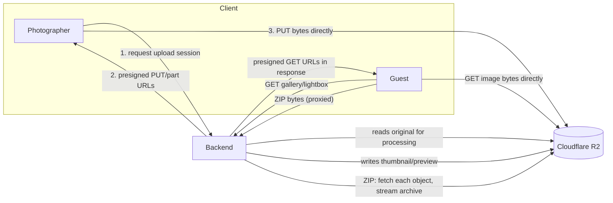
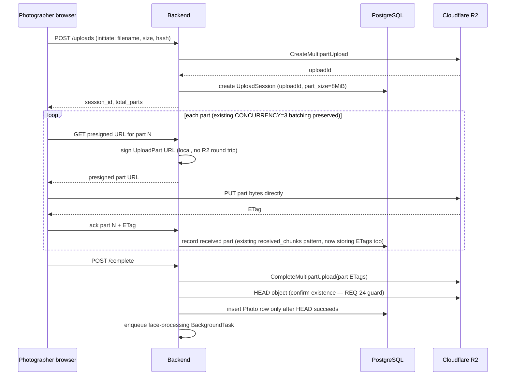
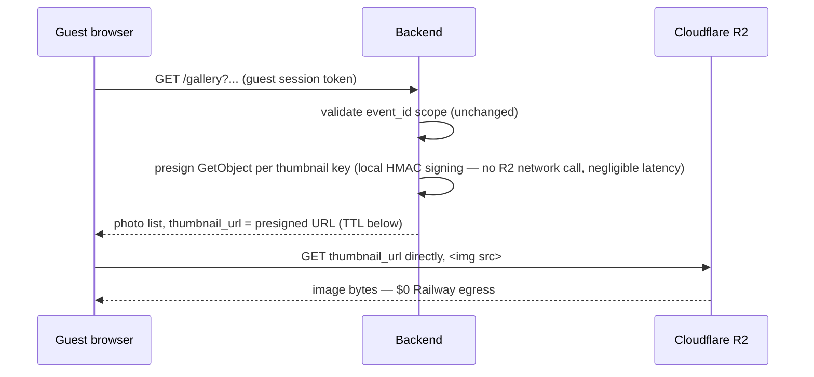
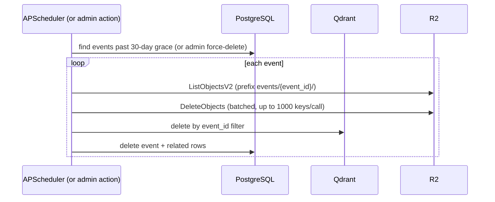

## Feature
docs/features/photo-storage-migration/requirements.md

## Inputs
- `docs/decisions/2026-08-22-cloudflare-r2-photo-storage.md` — storage backend decision
- `docs/decisions/2026-08-22-presigned-url-image-delivery.md` — read-delivery decision (this session)
- `docs/wip/analysis-photo-storage-migration-r2-2026-08-22.md` — impact analysis (loaded at session start)

## Decision summary
Presigned URLs end-to-end: uploads (chunked, guest, cover) write via presigned PUT/multipart directly to R2; reads (thumbnails, lightbox, single downloads, cover) are served as presigned GET URLs consumed directly by ``/`<a href>`. Bulk ZIP remains backend-proxied (unavoidable — no cross-object combine primitive in R2). Object key layout is unchanged from today (`events/{event_id}/{photo_id}.ext`, `.../thumbs/`, `.../previews/`, `.../downloads/`) — only the storage backend and access mechanism change, not the addressing scheme, which keeps the backfill migration a pure copy rather than a re-key.

## Architecture

Backend remains the sole authority that *issues* access (constraints 3/5 preserved at the authorization layer, per the storage ADR) — R2 never receives an unauthenticated request that didn't originate from a backend-minted URL.

## Upload path

### Chunked upload (photographer) — mapped onto R2 Multipart Upload
**Technical constraint found during design, not covered by the original ADR:** S3-compatible multipart upload requires every part except the last to be ≥5 MiB. The app's existing chunk size (`CHUNK_SIZE = 2097152`, 2 MiB — set in `2026-06-19-chunked-upload-chunk-size-concurrency.md`) is below that floor. **Decision: raise the app chunk size to 8 MiB** (comfortable margin above the 5 MiB floor, still small enough to keep resumability granularity reasonable) and map the existing chunk-tracking model 1:1 onto R2's native multipart primitive:

This preserves the existing session/resumability model from `2026-06-19-upload-session-state-postgresql.md` — `received_chunks` becomes "received parts with ETags," same shape, same idempotency semantics (REQ-1/REQ-2). The `2026-06-19-chunked-upload-chunk-size-concurrency.md` ADR needs a short superseding note for the chunk-size change; it doesn't need a full new ADR since the concurrency reasoning (not starving the face pipeline) is unaffected.

The existing read-modify-write race on `received_chunks` (flagged informally during the original incident triage, not previously an ADR) should be fixed in the same change by moving to a native array-append at the DB layer, since the migration already touches every line that reads/writes that column — cheap to fix now, expensive to isolate later.

### Guest upload / event cover upload (non-chunked)
Single presigned PUT URL, no multipart needed (both are small, single-request uploads today). Same "backend issues URL → client PUTs directly → backend HEADs to confirm before writing the DB row" shape as the chunked flow's completion step, just without the multipart machinery.

## Read path

Presigning is a local cryptographic operation (no network round-trip to R2), so this does not put the existing gallery NFR-1 (500ms p95 @ 50k photos) at risk from signing overhead alone — 50 signatures per batch is negligible CPU cost. This should still be spot-checked in `/build` against the NFR, not assumed.

### Presigned read URL TTL (resolves REQ-10 / OQ-4)
**Decision: 6-hour TTL** on all read URLs (thumbnail, lightbox, single-download, cover). Rationale: comfortably exceeds any realistic single browsing session (guest session idle window is 24h, but active browsing in one sitting is realistically under an hour); short enough that a leaked URL has bounded exposure, unlike the guest's actual session token. Because gallery/lightbox data is already re-fetched on pagination, filter/sort change, and page load (existing behavior, unchanged), URLs refresh naturally in the overwhelming majority of cases. For the edge case of a tab left open past 6 hours with no interaction: add an `onError` handler on `` that triggers a lightweight re-fetch of just that photo's URL rather than a full gallery reload — a small, additive frontend behavior, not a structural change.

### Component-by-component frontend change (per `2026-08-22-presigned-url-image-delivery.md`)
| Component | Change |
|---|---|
| `PhotoThumbnail.tsx` | Drop `guestFetchBlob` + `useEffect`; render `` directly |
| Favourites grid, `SearchResults` result cards | Same pattern |
| Photographer `PhotoCard` (photos.tsx), album detail grid, event-dashboard cover picker | Same pattern, using `ownerFetchBlob`'s call sites |
| `Lightbox.tsx` | Same pattern; additionally, backend response for the photo detail must now include a `lightbox_url` field — today this component hand-builds the `/lightbox` path itself, which no longer works once the endpoint returns a presigned R2 URL instead of proxying |
| Share page (`app/share/[token]/page.tsx`) | Same pattern; the `ShareTokenResponse` payload needs a `thumbnail_url` field added, since it currently hand-builds a `/thumbnail` path the same way `Lightbox` does |
| `downloadPhoto` (`lib/api.ts`) | Change from fetch-blob-then-synthetic-`<a>`-click to receiving `{ download_url }` from the backend and navigating/anchoring to it directly |
| `downloadZip`, `downloadFavouritesZip` | **Unchanged** — ZIP stays backend-proxied |
| `getEventCoverUrl` | Unchanged call shape; URL now points at R2 instead of the backend route |
| `guestFetchBlob`/`ownerFetchBlob`/`fetchAuthedBlob` | No longer needed for photo display after this ships; remove once confirmed no other caller depends on them |

## ZIP generation (unchanged pattern, new object source)
`zip_streaming.py`'s `zipfile.ZipFile.write(path)` needs a real filesystem path, which R2 objects aren't. Design approach: stream each constituent object from R2 (`GetObject`, chunked read) into a bounded-size local temp file (or directly into `zipfile.writestr` via a file-like wrapper around the streamed response body — avoids a temp file per photo, keeps the existing "no full in-memory buffering" guarantee from REQ-14/NFR-5), write it into the archive, then discard. This keeps peak memory/disk bounded per-photo regardless of the 200-photo cap, matching today's guarantee. To hit the 30-second/100-photo bar (REQ-15) despite now paying network latency per photo instead of a local disk read, fetch several objects concurrently (bounded pool, e.g. 4-8 in flight) ahead of the point where they're written into the archive, rather than the current fully sequential per-photo loop — sizing the concurrency is a `/build`-time tuning question, not a design decision.

## Thumbnail / preview / HEIC-conversion generation
No change in *who* generates these (still the face pipeline and gallery service, still triggered the same way) — only *where* bytes are read from and written to. Each becomes: `GetObject` (original) → existing PIL/pillow_heif processing, unchanged → `PutObject` (derived asset), replacing the local `Path.read_bytes()`/`img.save(local_path)` calls 1:1. The atomic temp-file-then-rename pattern `gallery.py` uses for local-disk writes (avoiding a reader seeing a half-written file) has no direct R2 equivalent — R2's `PutObject` is already atomic (a GET either sees the old object or the fully-written new one, never partial), so that temp+rename step is dropped, not replaced.

## Deletion / purge

**Unify `purge.py` and `admin.py`'s duplicated disk-cleanup logic into one shared function before/while migrating it** — otherwise this migration has to touch the same deletion logic twice and the two copies can drift again immediately. `ListObjectsV2` + `DeleteObjects` on the `events/{event_id}/` prefix replaces both `shutil.rmtree` calls; this also naturally covers thumbnails/previews/downloads/guest-uploaded photos/cover photos in one pass, since they all share the same event-scoped key prefix. "No partial deletion" (REQ-21) is best-effort-with-verification here, same as it always was — R2 has no cross-store transaction with Postgres/Qdrant any more than the local filesystem did; this migration doesn't newly introduce that gap, it just changes which store the best-effort cleanup targets.

## Backfill migration
Given the accepted short-maintenance-window budget (REQ-18): a one-off script iterates every `Photo` row (and cover-photo path per event), streams the object from the existing Railway Volume path, `PutObject`s it to R2 under the identical key, then `HeadObject`s to verify (REQ-19). Because object keys are unchanged, no `Photo.storage_path` rewrite is needed in the DB — the same relative key now resolves in R2 instead of on disk. Cutover is a single config flip (which backend the read/write code paths target) once backfill + verification completes for all events, during the scheduled window. No dual-write period, no per-event phased rollout — the maintenance-window budget makes the simpler all-at-once cutover sufficient.

## Guest uploads & event cover photos (scope-gap addendum)
Both fold into the patterns above with no new mechanism: guest uploads use the single presigned-PUT upload shape (not multipart); cover photos use the single presigned-GET read shape, and since `getEventCoverUrl` already returns a direct URL used in ``/CSS today, this is the one surface in the whole migration that requires zero frontend change regardless of anything else in this design.

## Non-functional validation carried into /build
- NFR-1 (gallery 500ms p95 @ 50k photos): verify presigning overhead is negligible under load, not just in principle.
- NFR-2/REQ-15 (ZIP 30s/100 photos): verify the concurrent-fetch approach actually hits this against real R2 latency, not local-disk baseline.
- NFR-5 (upload reliability at scale): verify 8 MiB parts + R2 multipart perform at least as well as today's 2 MiB local-disk chunks for the 500-photo/30-minute bar.

## Open questions for /build (implementation-level, not blocking design close)
- [ ] Exact concurrent-fetch pool size for ZIP generation — owner: Engineering
- [ ] S3-compatible client library choice (boto3 vs a lighter alternative) — owner: Engineering
- [ ] Final confirmation that 6-hour presigned URL TTL doesn't need per-endpoint tuning (e.g., cover photo could arguably be much longer-lived since it's low-sensitivity) — owner: Engineering
- [ ] Whether to delete the dead `uploadPhoto`/`photos.py:91-152` non-chunked endpoint in this change or a separate cleanup PR — owner: Engineering (leaning: separate PR, unrelated to storage backend)

## Status
Designed — ready for /build
