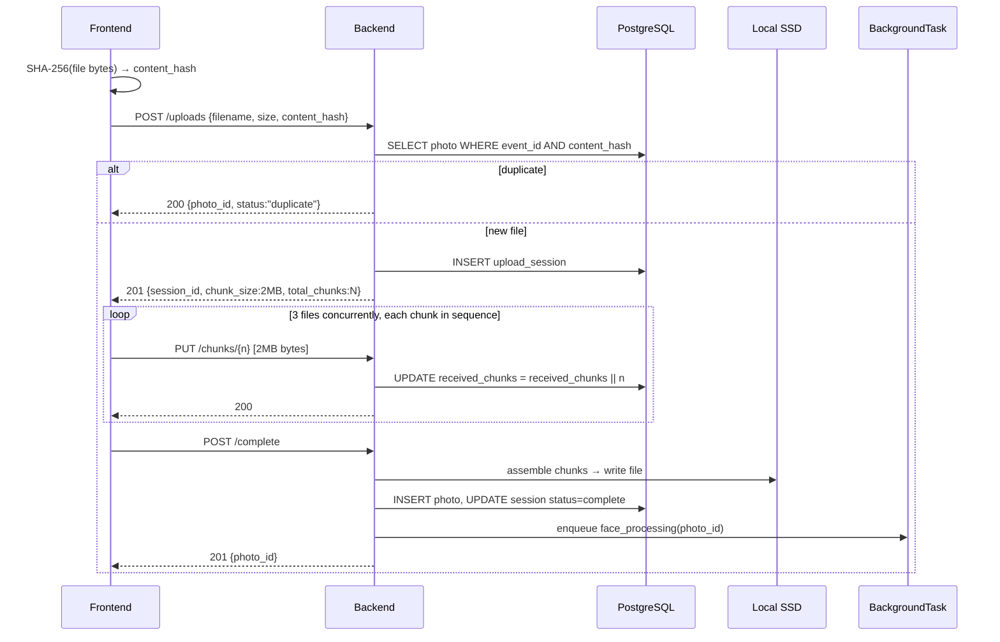
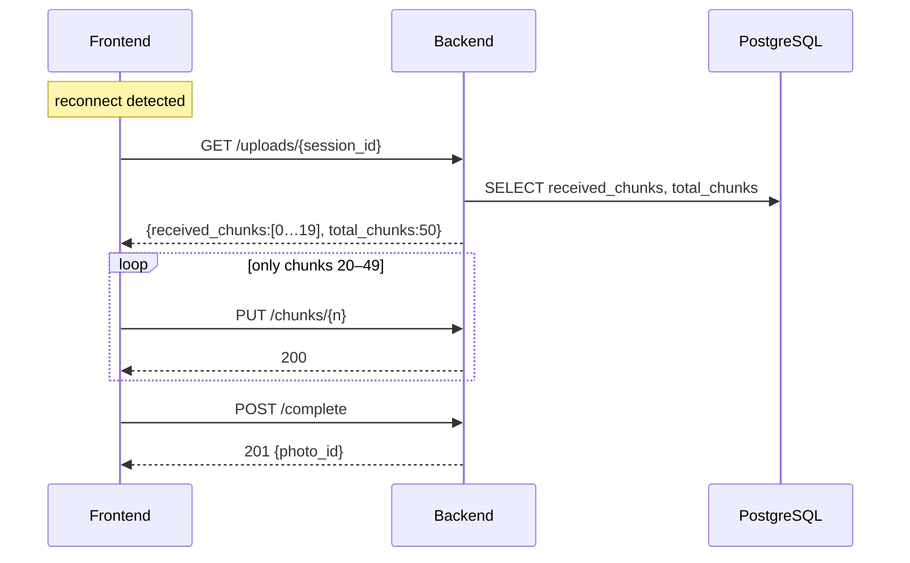
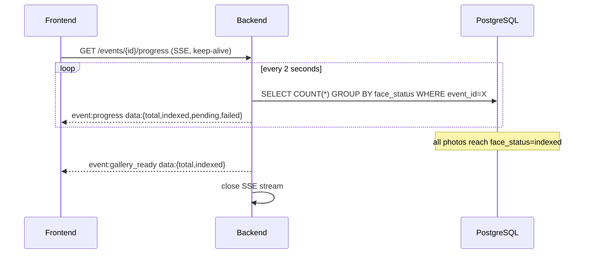

# Photographer Dashboard — Design

**Feature:** photographer-dashboard
**Status:** Fully shipped
**Date:** 2026-06-19 (OQ-D1 resolved 2026-06-21; Scenario 6 frontend groomed 2026-06-21)
**ADRs:** see references section

---

## Overview

The photographer dashboard introduces six backend capabilities and one new frontend surface:

1. Chunked photo upload with content-hash deduplication and automatic resume
2. Async face-processing enqueue per photo (existing BackgroundTask pattern)
3. SSE-based real-time progress stream
4. Album management with many-to-many photo assignment
5. Photographer Choice flag per photo
6. Photographer-to-event assignment and revocation

All capabilities sit strictly within the existing service boundary: frontend → backend REST API → PostgreSQL + SSD. No new services, no new external dependencies.

---

## Data Model

### New tables

```sql
-- Tracks in-flight chunked uploads; cleaned up on completion or abandonment
CREATE TABLE upload_sessions (
    id              UUID PRIMARY KEY DEFAULT gen_random_uuid(),
    event_id        UUID NOT NULL REFERENCES events(id) ON DELETE CASCADE,
    photographer_id UUID NOT NULL REFERENCES users(id),
    filename        TEXT NOT NULL,
    file_size_bytes BIGINT NOT NULL,
    content_hash    TEXT NOT NULL,          -- SHA-256 hex, computed client-side
    chunk_size_bytes INT NOT NULL DEFAULT 2097152,  -- 2 MB
    total_chunks    INT NOT NULL,
    received_chunks INT[] NOT NULL DEFAULT '{}',
    status          TEXT NOT NULL DEFAULT 'in_progress',  -- in_progress | complete | abandoned
    created_at      TIMESTAMPTZ NOT NULL DEFAULT now(),
    updated_at      TIMESTAMPTZ NOT NULL DEFAULT now()
);
CREATE INDEX ON upload_sessions(event_id, content_hash);  -- dedup lookup

-- Many-to-many: photos ↔ albums
CREATE TABLE photo_albums (
    photo_id UUID NOT NULL REFERENCES photos(id) ON DELETE CASCADE,
    album_id UUID NOT NULL REFERENCES albums(id) ON DELETE CASCADE,
    PRIMARY KEY (photo_id, album_id)
);

-- Photographer assignment to events (scoped, revocable)
CREATE TABLE event_photographers (
    event_id        UUID NOT NULL REFERENCES events(id) ON DELETE CASCADE,
    photographer_id UUID NOT NULL REFERENCES users(id) ON DELETE CASCADE,
    assigned_by     UUID NOT NULL REFERENCES users(id),
    assigned_at     TIMESTAMPTZ NOT NULL DEFAULT now(),
    PRIMARY KEY (event_id, photographer_id)
);
```

### Additions to existing tables

```sql
-- photos table
ALTER TABLE photos ADD COLUMN content_hash        TEXT;          -- SHA-256 hex; unique per event
ALTER TABLE photos ADD COLUMN photographer_choice  BOOLEAN NOT NULL DEFAULT FALSE;
ALTER TABLE photos ADD COLUMN face_status          TEXT NOT NULL DEFAULT 'pending';
    -- pending | indexed | failed
ALTER TABLE photos ADD COLUMN face_error           TEXT;          -- last error message on failure

CREATE UNIQUE INDEX photos_event_content_hash ON photos(event_id, content_hash);
```

---

## API Routes

### Upload (Scenario 1 & 2)

```
POST   /api/v1/events/{event_id}/uploads
         Body: { filename, file_size_bytes, content_hash }
         → 201 { session_id, chunk_size_bytes, total_chunks }
           or 200 { photo_id, status: "duplicate" }   ← dedup hit

GET    /api/v1/events/{event_id}/uploads/{session_id}
         → 200 { received_chunks: [0,1,…], total_chunks }   ← resume query

PUT    /api/v1/events/{event_id}/uploads/{session_id}/chunks/{chunk_index}
         Body: raw chunk bytes (Content-Type: application/octet-stream)
         → 200 { chunk_index, received: true }

POST   /api/v1/events/{event_id}/uploads/{session_id}/complete
         → 201 { photo_id }   ← assembles file, enqueues BackgroundTask
```

### Progress (Scenario 3)

```
GET    /api/v1/events/{event_id}/progress   (SSE)
         → text/event-stream
           event: progress
           data: {"total":100,"indexed":42,"pending":55,"failed":3}

           event: gallery_ready
           data: {"total":100,"indexed":100}
```

### Albums (Scenario 4)

```
POST   /api/v1/events/{event_id}/albums
         Body: { name, category_tag? }
         → 201 { album_id }

PATCH  /api/v1/events/{event_id}/albums/{album_id}
         Body: { name?, category_tag? }
         → 200

DELETE /api/v1/events/{event_id}/albums/{album_id}
         → 200  (photos move to uncategorized — rows deleted from photo_albums)

PUT    /api/v1/events/{event_id}/photos/{photo_id}/albums
         Body: { album_ids: [uuid, …] }   ← replaces all album assignments for this photo
         → 200
```

### Photographer Choice (Scenario 5)

```
PATCH  /api/v1/events/{event_id}/photos/{photo_id}
         Body: { photographer_choice: bool }
         → 200
         Auth: photographer or event owner only; guest JWT → 403
```

### Photographer Assignment (Scenario 6)

```
POST   /api/v1/events/{event_id}/photographers
         Body: { email }
         → 201 { photographer_id }   ← owner only

DELETE /api/v1/events/{event_id}/photographers/{photographer_id}
         → 200   ← owner only; immediate revocation

GET    /api/v1/photographers/me/events
         → 200 { events: […] }   ← photographer's assigned-event list
```

### Face job retry

```
POST   /api/v1/events/{event_id}/photos/{photo_id}/reprocess
         → 202   ← re-enqueues BackgroundTask; resets face_status to 'pending'
```

---

## Sequence Diagrams

### Upload — first time



### Upload — resume after disconnect



### Progress — SSE stream



---

## Authorization Matrix

| Action | Event owner | Assigned photographer | Guest |
|--------|------------|----------------------|-------|
| Initiate upload | ✅ | ✅ | ❌ 403 |
| Upload chunks | ✅ | ✅ (own sessions) | ❌ 403 |
| View progress | ✅ | ✅ | ❌ 403 |
| Create / rename album | ✅ | ✅ | ❌ 403 |
| Delete album | ✅ | ✅ | ❌ 403 |
| Assign photos to albums | ✅ | ✅ | ❌ 403 |
| Set Photographer Choice flag | ✅ | ✅ | ❌ 403 |
| Assign photographer to event | ✅ | ❌ 403 | ❌ 403 |
| Remove photographer from event | ✅ | ❌ 403 | ❌ 403 |
| Reprocess failed photo | ✅ | ✅ | ❌ 403 |

---

## Constraint compliance

| Constraint | How this design satisfies it |
|------------|------------------------------|
| Face processing async (C-1) | `POST /complete` enqueues `BackgroundTask` and returns 201 before processing starts |
| Frontend never writes to stores directly (C-4, C-5) | All file writes go through backend endpoints; frontend sends bytes to `/chunks/{n}` only |
| Face jobs idempotent (C-6) | Before inserting a face record, the BackgroundTask checks for an existing record by `photo_id`; dedup index on `(event_id, content_hash)` prevents duplicate photo records |
| No cross-event leakage (C-3) | All routes are scoped under `event_id`; authorization middleware validates the requesting user is owner or assigned photographer for that specific event |

---

## Chunk Assembly (OQ-D1 resolved)

**Decision:** Stream-assemble from SSD temp files — Option C.

Chunks are written to SSD as they arrive; `/complete` streams them in order into the final file path using a 2 MB read buffer. Memory ceiling is one chunk (2 MB) regardless of total file size. The DB `upload_sessions` table tracks chunk indices only (no blob storage).

### Temp-file layout

```
<STORAGE_PATH>/
  tmp/
    <session_id>/
      0.bin
      1.bin
      …
      N.bin
  events/
    <event_id>/
      <photo_id>.<ext>    ← assembled final file
```

### Assembly on `/complete`

```python
# pseudocode — implementation detail for /build
final_path = storage_path / "events" / event_id / photo_id
with open(final_path, "wb") as out:
    for i in range(total_chunks):
        chunk_path = storage_path / "tmp" / session_id / f"{i}.bin"
        with open(chunk_path, "rb") as src:
            shutil.copyfileobj(src, out, length=CHUNK_SIZE)
shutil.rmtree(storage_path / "tmp" / session_id)
```

### Abandonment cleanup (OQ-D2 resolved)

APScheduler job at 02:00 daily:
1. Query `upload_sessions` where `status = 'in_progress'` and `updated_at < now() - interval '24 hours'`
2. Delete `<STORAGE_PATH>/tmp/<session_id>/` for each
3. Set `status = 'abandoned'` on each session row

---

---

## Scenario 6 — Frontend Design

> **Build status:** Fully shipped. `GET /api/v1/events/{event_id}/photographers` added; 6a and 6b frontend surfaces built.

---

### 6a — "Manage Photographers" section on the Event Detail page

**Where:** `app/events/[eventId]/page.tsx` — new section card between "Event Details" form and "Danger Zone".

**Visible to:** Event owner only. Assigned photographers cannot view event settings and are redirected to the photos page (see §6b).

#### Required backend addition

`GET /api/v1/events/{event_id}/photographers` is missing. The UI needs to list current assignees on page load. This endpoint must be added to `routers/assignments.py` before the frontend can be built.

Response shape (new):
```json
{
  "photographers": [
    { "photographer_id": "<uuid>", "email": "...", "assigned_at": "<iso8601>" }
  ]
}
```

Add a corresponding `getEventPhotographers(eventId)` function to `lib/api.ts`.

#### UI layout

```
┌─ Photographers ───────────────────────────────────────────┐
│                                                            │
│  Assign a photographer                                     │
│  ┌──────────────────────────────────┐  ┌──────────────┐   │
│  │  photographer@studio.com         │  │   Assign     │   │
│  └──────────────────────────────────┘  └──────────────┘   │
│  [inline error if email not found or already assigned]     │
│                                                            │
│  Currently assigned                                        │
│  ┌────────────────────────────────────────────────────┐    │
│  │  jane@studio.com          Assigned 21 Jun   Remove │    │
│  │  ravi@photos.in           Assigned 20 Jun   Remove │    │
│  └────────────────────────────────────────────────────┘    │
│  (empty state: "No photographers assigned yet.")           │
└────────────────────────────────────────────────────────────┘
```

#### Interactions

| Action | API call | Success | Error |
|--------|----------|---------|-------|
| Page load | `GET /events/{id}/photographers` | Populate list | Show inline error in section |
| Assign (submit) | `POST /events/{id}/photographers` `{email}` | Append row, clear input | "No account found for this email" / "Already assigned" |
| Remove | `DELETE /events/{id}/photographers/{pid}` | Remove row | Inline error on row |

- The Assign button is disabled while a request is in flight.
- Removing requires no confirmation dialog (revocation is immediate per REQ-24; the owner can re-assign).
- The section is only rendered when `event.owner_id === currentUser.id`; assigned photographers do not see it.

#### State

```ts
const [photographers, setPhotographers]   = useState<AssignedPhotographerRow[]>([]);
const [assignEmail, setAssignEmail]       = useState('');
const [assignError, setAssignError]       = useState('');
const [isAssigning, setIsAssigning]       = useState(false);
const [removingId, setRemovingId]         = useState<string | null>(null);

interface AssignedPhotographerRow {
  photographer_id: string;
  email: string;
  assigned_at: string;
}
```

#### Acceptance criteria (UI)

- **AC-6-UI-1:** On page load, the section renders the list of currently assigned photographers (email + assigned date). An empty list shows "No photographers assigned yet."
- **AC-6-UI-2:** Submitting a valid email that maps to a registered user appends that user to the list without a full page reload.
- **AC-6-UI-3:** Submitting an email with no matching account shows "No account found for this email" inline; the list is unchanged.
- **AC-6-UI-4:** Submitting an email that is already assigned shows "Already assigned to this event" inline; no duplicate row appears.
- **AC-6-UI-5:** Clicking Remove on a row removes it immediately. The backend revokes access; a subsequent upload attempt by that photographer returns 403.
- **AC-6-UI-6:** The section is not rendered when the page is viewed by an assigned photographer (non-owner).

---

### 6b — "Assigned Events" section on the Photographer Dashboard

**Where:** `app/dashboard/page.tsx` — new section rendered below the "My Events" grid.

**Visible to:** Any authenticated user who has at least one assigned event. Hidden when `assignedEvents` is empty.

**API:** `GET /api/v1/photographers/me/events` → `getMyAssignedEvents()` (already in `lib/api.ts`).

#### UI layout

```
My Events                                          + New Event
┌──────────────────────┐  ┌──────────────────────┐
│  Smith & Jones       │  │  Patel & Sharma       │
│  ...                 │  │  ...                  │
└──────────────────────┘  └──────────────────────┘

Events I'm Photographing
┌──────────────────────┐  ┌──────────────────────┐
│  Kumar Wedding       │  │  Mehta Reception      │
│  Photographer        │  │  Photographer         │
│  [Manage Photos →]   │  │  [Manage Photos →]    │
└──────────────────────┘  └──────────────────────┘
```

#### Interactions

- On mount, call `getMyAssignedEvents()` alongside `getDashboardEvents()` — both are independent; run with `Promise.all`.
- If the call fails, show a subtle inline error ("Could not load assigned events") in the section; do not affect the owned-events section.
- Each assigned event card links to `/events/[id]/photos` (not `/events/[id]` — assigned photographers cannot access event settings, which would 403).
- Cards show: event name, a "Photographer" role badge, and a "Manage Photos →" link.
- The section heading "Events I'm Photographing" is not rendered if `assignedEvents.length === 0`.

#### Assigned event card design

Reuse `EventCard` component structure but:
- Add a `role` prop (`"owner" | "photographer"`) — if `"photographer"`, render a small grey "Photographer" badge instead of the status badge.
- The card's primary action link points to `/events/[id]/photos` rather than `/events/[id]`.
- Do not show "Edit" or event settings affordances.

If `EventCard` cannot easily accept a `role` prop, create a lightweight `AssignedEventCard` component alongside it.

#### State additions to `dashboard/page.tsx`

```ts
const [assignedEvents, setAssignedEvents]     = useState<AssignedEvent[]>([]);
const [assignedEventsError, setAssignedEventsError] = useState('');

interface AssignedEvent {
  id: string;
  name: string;
  slug: string;
  status: string;
  bride_name: string | null;
  groom_name: string | null;
  created_at: string;
}
```

Load both lists together:
```ts
Promise.all([getDashboardEvents(), getMyAssignedEvents()])
  .then(([owned, { events: assigned }]) => {
    setEvents(owned);
    setAssignedEvents(assigned);
  })
  ...
```

#### Acceptance criteria (UI)

- **AC-6b-UI-1:** A photographer assigned to two events sees both under "Events I'm Photographing" on the dashboard, in addition to any events they own.
- **AC-6b-UI-2:** Each assigned event card shows the event name and a "Photographer" role badge; clicking "Manage Photos" navigates to `/events/[id]/photos`.
- **AC-6b-UI-3:** The "Events I'm Photographing" section is not rendered for users who have no assigned events.
- **AC-6b-UI-4:** An owned event does not appear in the assigned-events section even if the owner is also in the `event_photographers` table.
- **AC-6b-UI-5:** After an assignment is revoked by the event owner, the card disappears from the photographer's dashboard on next load.

---

## Open Questions

| # | Question | Owner | Status |
|---|----------|-------|--------|
| ~~OQ-D1~~ | ~~Chunk assembly strategy~~ | Engineering | **Resolved 2026-06-21 — Option C (SSD temp files, stream assembly)** |
| ~~OQ-D2~~ | ~~Upload session abandonment period~~ | Engineering | **Resolved 2026-06-21 — 24h, cleaned by APScheduler** |
| OQ-D3 | SSE connection timeout — how long before client must reconnect? (Suggested: 60s) | Engineering | Low priority — does not block build |
| ~~OQ-D4~~ | ~~`GET /events/{id}/photographers` — response should include the assigner's name/email for auditability, or just photographer email?~~ | Engineering | **Resolved — photographer email + assigned_at only; UI requires no assigner info** |

---

## ADR References

- `docs/decisions/2026-06-19-chunked-upload-chunk-size-concurrency.md`
- `docs/decisions/2026-06-19-upload-progress-sse.md`
- `docs/decisions/2026-06-19-upload-session-state-postgresql.md`
- `docs/decisions/2026-06-19-photographer-event-assignment-schema.md`
