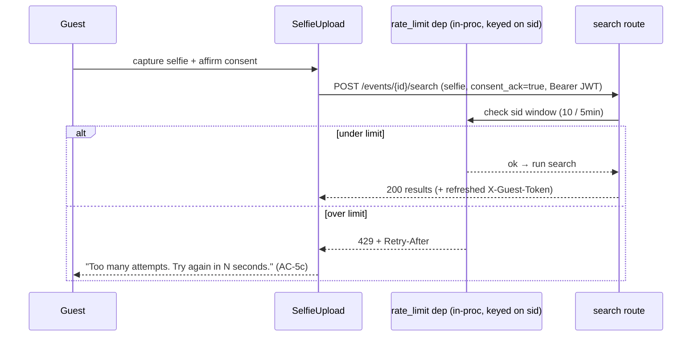
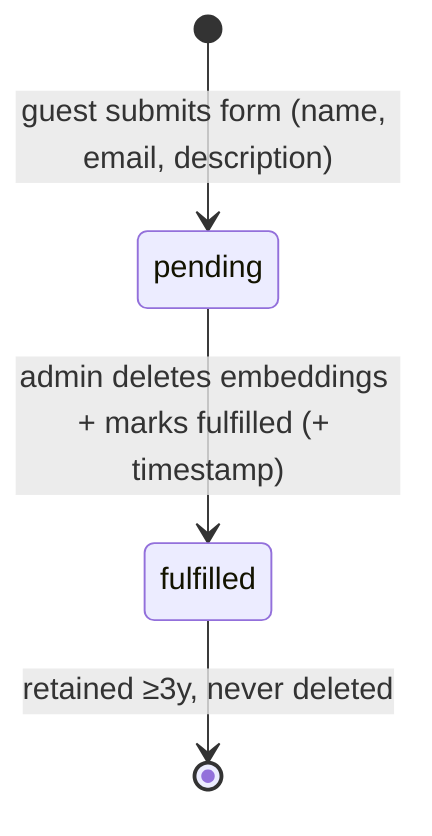

# Design: Privacy & Security

**Status:** Designed — ready for /build
**Date:** 2026-06-22
**Requirements:** `docs/features/privacy-security/requirements.md`
**Impact analysis:** `docs/wip/analysis-privacy-security-shared-interfaces-2026-06-22.md` (2026-06-22)
**Compliance frame:** India DPDP Act 2023 — platform = Data Fiduciary, guests = Data Principals.

This feature is the **governance layer**. The technical controls it references — embedding
encryption and selfie auto-deletion — are implemented in the AI Face Processing and Face
Recognition Search epics. This design adds: consent capture, the privacy notice, the removal
request workflow, rate limiting, the HSTS/TLS posture, and the encryption-audit surface.

---

## Existing building blocks this design reuses

| Asset | Location | Used for |
|-------|----------|----------|
| `GuestRateLimiter` (in-process per-IP lockout) | `backend/app/services/guest_auth.py:56` | Pattern mirrored for selfie/search rate limiting |
| `sid` claim in guest JWT (stable per-session UUID, survives refresh) | ADR 2026-06-20 | Rate-limit key (REQ-17/18) |
| `publish_event(db, event)` + `current_user` | `backend/app/routers/events.py:139`, `services/events.py:201` | Server-side consent recording at publish |
| Dual-storage encryption (`face_records.embedding_enc`, AES-256-GCM) | ADR 2026-06-19 | The verifiable encryption artifact for the audit endpoint |
| APScheduler purge (30-day) | `system.md`, ADR 2026-06-19 | The retention rule the privacy notice cites |

---

## Design decisions

### D1 — Owner consent recorded server-side at publish *(non-breaking)*
The publish endpoint contract is unchanged. Consent is written inside `publish_event` using the
authenticated `current_user.id` and server clock. The checkbox (REQ-1/2) is a frontend pre-flight
gate only. Republish re-runs the same path → a fresh record (REQ-4) with no extra wiring.

**Rejected:** sending an explicit consent payload in the publish request — adds a contract change
for no benefit, since the confirming identity is already in the JWT.

### D2 — Selfie-upload and search are ONE rate-limited endpoint
Per the impact analysis, there is no separate selfie-upload endpoint —
`POST /api/v1/events/{event_id}/search` *is* both. **REQ-17 ≡ REQ-18**: one sliding-window rule
(10 requests / 5-minute window) on that single route.

### D3 — In-process sliding-window rate limiter, keyed on `sid` *(amends NFR-4)*
Mirror the existing `GuestRateLimiter` pattern: a new in-process limiter keyed on the JWT `sid`
claim, enforced as a **FastAPI dependency** on the search route (not global middleware — only this
route is limited). On breach: HTTP 429 + `Retry-After` (seconds to window reset).

- **Chosen over Redis** for the single-VM MVP: zero new infra, consistent with the existing
  lockout pattern. Trade-off: counters reset on restart (brief fail-open) — **NFR-4 amended** to
  accept this for MVP (see Requirement amendments). See ADR `2026-06-22-guest-search-in-process-rate-limiter`.
- **Dependency over middleware:** scopes enforcement to exactly the search route and gives clean
  access to the decoded `sid`; avoids inspecting every request path in a global hook.

### D4 — Encryption audit verifies PostgreSQL `embedding_enc`, NOT Qdrant *(amends REQ-24)*
The dual-storage ADR makes Qdrant intentionally **plaintext** (encrypting payloads breaks vector
search) and Qdrant Cloud free tier exposes no queryable payload-encryption flag. The real,
application-controlled "encrypted at rest" artifact is `face_records.embedding_enc` (AES-256-GCM).

The internal audit endpoint (`GET /internal/audit/embedding-encryption`, admin-only, not publicly
routable) returns `{"embeddings_encrypted": bool, ...}` by verifying that indexed `face_records`
have **non-null, decryptable** `embedding_enc`. REQ-24/AC-7a wording is amended to drop the Qdrant
framing. See ADR `2026-06-22-encryption-audit-verifies-postgres`.

### D5 — Guest consent affirmation: server-enforced precondition, no per-guest DB row
Guests are anonymous (constraint: "identity is not stored"); selfies are deleted immediately; PII
must never be logged. So the REQ-8a affirmation is **not** persisted as an identifiable consent
row. Instead:
- The "I understand, continue" gate (incl. the 18+/guardian affirmation) is enforced client-side
  before the camera activates (REQ-6/AC-2e).
- The search request carries a required `consent_ack=true` field; the backend **rejects the
  request (422)** if absent — making the gate server-enforced, not bypassable by calling the API
  directly.
- The "record" is a non-PII structured log line: `event_id`, `sid`, timestamp. No name, no image,
  no embedding in the log (satisfies the logging constraint).

### D6 — Removal requests: new table, dashboard-flag notification, never deleted
New `removal_requests` table. Guest submits via a form on the event page (auth via existing guest
session). Admin notification for MVP is a **dashboard flag/badge** (count of `pending` requests) —
no email dependency. Admin marks `fulfilled` with a timestamp; rows are **never deleted** (REQ-16)
and retained ≥3 years (NFR-6).

### D7 — TLS posture: proxy owns termination, backend owns HSTS
Nginx + Let's Encrypt (Ops layer) own TLS termination, the HTTP→HTTPS redirect, and the TLS 1.2+
floor (REQ-21/22, AC-6a/6c). The backend's only responsibility: emit
`Strict-Transport-Security: max-age=31536000; includeSubDomains` on all responses (lightweight
middleware) and trust `X-Forwarded-Proto` from the proxy (REQ-23/AC-6b).

### D8 — `/privacy` is a static Next.js route
No backend call (NFR-5). Unauthenticated, HTTP 200, English-only for MVP. Content per REQ-8/AC-2d:
data collected (face embedding), purpose, legal basis (DPDP §6 consent), Data Fiduciary identity
(the platform), 30-day retention, consent-withdrawal + removal-request instructions.

---

## Data model (proposed — formalize via /data-model before build)

```sql
-- Consent confirmations (S1). Retained ≥3y, independent of event lifecycle (NFR-6).
consent_records(
  id            uuid pk,
  event_id      uuid not null references events(id),  -- NO cascade-delete: outlives the event
  confirmed_by  uuid not null references users(id),    -- the photographer/owner
  confirmed_at  timestamptz not null
)

-- Face-data removal requests (S3/S4). Never deleted (REQ-16), retained ≥3y (NFR-6).
removal_requests(
  id            uuid pk,
  event_id      uuid not null references events(id),  -- NO cascade-delete
  submitted_at  timestamptz not null,
  guest_name    text not null,
  guest_email   text not null,
  description    text not null,     -- when they uploaded a selfie, to aid admin lookup
  status        text not null default 'pending',  -- 'pending' | 'fulfilled'
  fulfilled_at  timestamptz null
)
```

> ⚠️ **Retention vs purge tension (flagged for /data-model):** the 30-day event purge
> (`purge_expired_events`) does `DELETE CASCADE` on event data. `consent_records` and
> `removal_requests` must **survive** that purge (NFR-6, REQ-16) — so they must NOT be
> `ON DELETE CASCADE` from `events`, and the purge job must be reviewed to ensure it does not
> delete them. This is the one place the new tables interact with an existing scheduled job.

---

## Flows

### Consent at publish (S1)
```mermaid
sequenceDiagram
    participant O as Owner (dashboard)
    participant FE as Frontend
    participant BE as Backend
    participant PG as PostgreSQL
    O->>FE: open publish pre-flight
    FE-->>O: checkbox (unchecked, not pre-filled); publish disabled
    O->>FE: check box (explicit gesture) → publish enabled
    O->>FE: click Publish
    FE->>BE: POST /events/{id}/publish  (no body change)
    BE->>PG: INSERT consent_records(event_id, current_user.id, now())
    BE->>PG: UPDATE events SET status='published'
    BE-->>FE: EventOut
```

### Rate-limited search (S5)


### Removal request lifecycle (S3/S4)


---

## Requirement amendments needed (route through /groom or note in requirements.md)

1. **REQ-24 / AC-7a** — replace "Qdrant collection configured with payload encryption" with
   "PostgreSQL `face_records.embedding_enc` is populated and decryptable." Rationale: dual-storage
   ADR; Qdrant is plaintext by design. (Decision D4.)
2. **NFR-4** — drop "survives a backend restart"; state explicitly that the in-process limiter
   resets on restart (acceptable fail-open for MVP single-VM). Redis is the documented upgrade path
   if multi-instance deployment is ever introduced. (Decision D3.)
3. **REQ-17 vs REQ-18** — footnote that both refer to the single `/search` endpoint in the current
   implementation; one rule covers both. (Decision D2.)

---

## ADRs written with this design
- `docs/decisions/2026-06-22-encryption-audit-verifies-postgres.md` (D4)
- `docs/decisions/2026-06-22-guest-search-in-process-rate-limiter.md` (D3)

(D1 consent-at-publish and D7 HSTS are additive and follow existing patterns — captured here, no
separate ADR. The `consent_records`/`removal_requests` schema should get an ADR at build time if
the retention-vs-purge handling proves non-obvious.)

---

## Constraint check (`docs/architecture/constraints.md`)
- ✅ Rule 2 (embeddings encrypted at rest): unchanged — audit endpoint *verifies* the existing
  control, does not weaken it.
- ✅ Rule 3 (per-`event_id` scoping): removal requests and consent records are event-scoped.
- ✅ Rule 4/5 (frontend→backend only; backend owns stores): no new direct store access.
- ✅ Logging standard (no PII): D5 logs only `event_id`/`sid`/timestamp; no name/email/image.
- ⚠️ No rule violated. The retention-vs-purge interaction (new tables must survive the 30-day
  cascade) is a build-time correctness item, not a constraint violation.

---

## Open questions
- [ ] Should removal requests trigger a guest **confirmation email**? — owner: Product. MVP =
  on-screen only (carried over from grooming; requires a transactional email service).
- [ ] Biometric **DPA** for event owners to sign? — owner: Legal (process, not a build blocker).
- [ ] Self-affirmation (REQ-8a) is not strictly "verifiable" parental consent under DPDP §9 —
  flagged for Legal; accepted for MVP.
- [ ] `/data-model` to formalize the two new tables + confirm the purge job excludes them.
