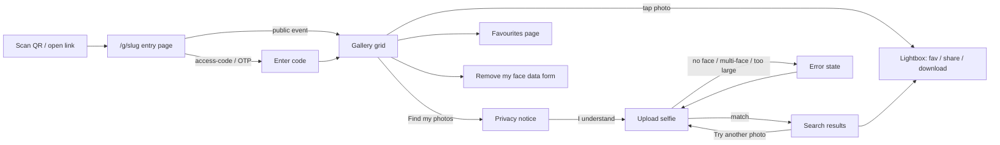
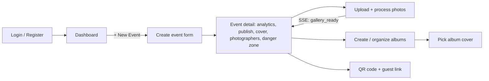

## Context

This is a UX audit of WeddingLens as currently implemented — not a pre-build design doc. No feature in this codebase has an `ux.md` yet; requirements went straight to `design.md` and into code. This document reviews the shipped frontend (`frontend/app/`, `frontend/components/`) across the three user types the system serves:

- **Guests** — arrive via QR code or link, no account, want to find and download their own photos fast, on a phone, often on venue wifi.
- **Photographers / event owners** — upload thousands of photos per event, organize into albums, control publish/access, and hand a QR code to the couple.
- **Platform admins** — monitor processing health across all events and handle legal-adjacent requests (face-data removal, suspensions).

The goal here is to describe what a user actually experiences today, flag friction, and surface decisions worth revisiting — not to redesign from scratch.

---

## Primary flow — Guest journey

**Who:** A wedding guest with no account, holding a phone, scanning a QR code at the venue or days later from a WhatsApp link.

**Steps:**
1. Scans QR → lands on `/g/[slug]`.
2. If the event is `public`, they're bounced straight to the gallery — no form. If it's `access-code` or `magic-link-otp`, they see an event header (name, couple, date) and a single code input.
3. Land on `/g/[slug]/gallery`: photo grid, filterable by album tabs (Ceremony/Sangeet/Mehendi/...), sortable by Latest/Popular/Photographer's Choice, infinite "Load more".
4. Tap **Find my photos** → one-time privacy notice ("your selfie is deleted immediately, embeddings purged within 30 days") they must acknowledge → native camera/file picker → results grid of just their photos.
5. On any photo (gallery, results, or full-screen lightbox): heart to favourite, share icon to copy a 72-hour public link, download single or bulk ZIP (capped at 200).
6. Optionally visits **Favourites** (persisted server-side per guest token) or submits a **Remove my face data** request from the gallery header.

**Notable friction in this flow:**
- The privacy-notice gate resets every time the search page remounts (it's local component state, not persisted). A guest who searches, leaves for the gallery, and comes back to search again re-clicks through the same notice — reasonable for legal exposure, mildly annoying for repeat use.
- Selfie upload has no preview/crop step — pick a file and the search fires immediately. If it's a bad shot, the guest only learns that after a full round trip via `SearchError`.
- ZIP bulk-download and single-photo download in the lightbox fail **silently** on error (comment in code: *"download errors are silent — the browser will show nothing"*). Every other guest-facing action (search, code entry) shows an inline message on failure; downloads don't.
- The code-entry form collapses most backend errors into a generic "Invalid code" — a guest who's actually rate-limited or whose access was revoked gets a distinguishable message only if the error string happens to contain "too many"/"lockout"/"revoked". There's no "N attempts remaining" warning before lockout.

---

## Primary flow — Photographer / event owner journey

**Who:** The event owner (or a photographer they've assigned) managing one wedding, from account creation through handing guests a working QR code.

**Steps:**
1. Register/login (email + password, no forgot-password path visible) → `/dashboard`, split into "My Events" (owned) and "Events I'm Photographing" (assigned, read-only elsewhere).
2. **Create event**: name, bride/groom, date, access mode (public / access-code / magic-link-otp), URL slug (auto-suggested from names, editable, with conflict suggestions).
3. Land on the event detail page — the single busiest screen in the product (see finding below): analytics, publish/unpublish (gated by a consent checkbox), guest-access revoke toggle, cover-photo picker, the full edit form, photographer assignment, and a danger-zone hard delete.
4. **Manage Photos**: drag-and-drop or click-to-browse multi-upload with per-file chunked/resumable upload (hash-based dedup, 3 concurrent, retry on chunk failure), a live SSE panel showing pending/processing/complete/failed counts and a "Gallery ready — guests can now search!" banner, and a grid where each photo gets its own album-assignment dropdown and Photographer's Choice star toggle.
5. **Manage Albums**: create/rename/delete (max 10), toggle public/private, open an album to pick its cover photo.
6. **QR Code page**: auth-fetched QR image, guest link with copy-to-clipboard, PNG download.

**Notable friction in this flow:**
- **Event detail page carries seven distinct jobs on one screen**: analytics, publish/consent, guest-access revoke, cover photo, event-details form, photographer management, danger zone. There's no tab or section nav — it's one long scroll, and the destructive "Delete Event" action sits at the very bottom with no sticky context. For a first-time owner this is a lot to parse before they even get to uploading photos.
- The publish button copy says a cover photo is "**Required to publish**," but the button's disabled logic only checks the consent checkbox and event status — not whether `cover_photo_id` is set. Worth verifying against the backend: either the UI should also gate on cover photo, or the copy overstates a rule the server doesn't actually enforce at that point.
- Album (re)assignment on the Photos page is one dropdown per photo, no multi-select. For an app whose own `CLAUDE.md` describes "thousands of wedding pictures," sorting a full event into albums one photo at a time is the single biggest scaling gap in the photographer experience.
- SSE reconnect on drop is a silent 60-second fixed backoff — if the connection dies mid-upload, the processing panel just goes stale with no "reconnecting…" indicator.
- Delete confirmations are inconsistent in weight: deleting an **event** requires typing `DELETE`; deleting an **album** (which can hold hundreds of photos, un-albuming them) is a single-click confirm dialog with no typed confirmation.

---

## Secondary flow — Platform admin

**Who:** A platform operator monitoring all events, handling suspensions, and clearing face-data removal requests.

- `/admin`: platform health tiles (events, photos, storage, 24h error rate) → paginated events table (suspend/unsuspend/delete, no search or filter by owner/name) → a second, separate list of pending face-data removal requests with a one-way "Mark fulfilled" action.
- `/admin/events/[eventId]`: read-only detail (owner, storage, per-event processing monitor breakdown) — no actions live here; suspend/delete only exist back on the list.

**Notable gaps:** no search/filter on the admin events table (fine at pilot scale, won't hold up as event count grows), and no visibility into *already-fulfilled* removal requests — once marked done, a request disappears with no audit trail in the UI.

---

## Screen / component inventory

| Screen | Purpose | Entry points | Exit points |
|---|---|---|---|
| `/g/[slug]` | Guest entry — code/OTP gate or straight through for public events | QR code, shared link | Gallery |
| `/g/[slug]/gallery` | Browse all event photos, filter/sort, lightbox | Entry page, nav links | Search, Favourites, Lightbox |
| `/g/[slug]/search` | Privacy notice → selfie upload → personal results | Gallery header CTA | Results, retry loop |
| `/g/[slug]/favourites` | Guest's saved photos, bulk ZIP | Gallery header | Gallery |
| `/share/[token]` | Single shared photo, 72h expiry | External share link | Home, or entry page if unauthenticated |
| `/events/[eventId]/search` | **Dead** — orphaned duplicate of the guest search flow, keyed by `eventId` instead of slug | None — no link, redirect, or generated URL reaches it anywhere in the codebase | — |
| `/login`, `/register` | Owner/photographer auth | Nav, root redirect | Dashboard |
| `/dashboard` | Owned + assigned events list | Nav, post-login | Create event, event detail |
| `/events/new` | Create event | Dashboard | Event detail |
| `/events/[eventId]` | Event settings hub (analytics, publish, cover, form, photographers, delete) | Dashboard, breadcrumbs | Photos, Albums, QR |
| `/events/[eventId]/photos` | Upload + per-photo album/choice management, SSE processing status | Event detail | — |
| `/events/[eventId]/albums` | Create/rename/delete/visibility | Event detail | Album detail |
| `/events/[eventId]/albums/[albumId]` | Pick album cover | Albums list | Albums list |
| `/events/[eventId]/qr` | QR image, guest link, PNG download | Event detail | — |
| `/admin` | Platform health, all-events table, removal-request queue | Nav (admin users only) | Admin event detail |
| `/admin/events/[eventId]` | Read-only event/processing detail | Admin table | Admin list |
| `/privacy` | Platform privacy notice | Search consent notice link | — |

---

## Edge cases and error states

| Condition | What the user sees | What the system does |
|---|---|---|
| Guest enters wrong access code | Generic "Invalid code. Please check and try again." | No attempts-remaining counter; only surfaces distinct copy for lockout/revoked if the error string matches a keyword |
| Guest hits rate limit on code entry or search | "Too many attempts..." with a wait time when available | 429 handled explicitly; `Retry-After` header parsed when present |
| Selfie has no detectable face / multiple faces / >20MB | Specific inline message per case (`SearchError`) | Client checks file size before upload; face-detection errors come from the backend |
| Guest downloads a photo or ZIP and it fails | **Nothing** — button just stops spinning | Error is caught and swallowed; no toast/inline message |
| Guest opens an expired/invalid/unauthenticated share link | Distinct "Link expired" / "Invalid link" / "Access required" screens | `resolveShareToken` error is inspected for `link_expired` detail |
| Owner tries to publish without checking the consent box | Publish button disabled, amber hint: "Check the box above to enable the Publish button." | Consent resets after every publish/unpublish toggle, forcing re-confirmation each time |
| Assigned photographer (non-owner) views event settings | Blue banner: "You have view-only access..."; all fields disabled | Backend presumably enforces this too — not verified in this pass |
| Photo upload fails mid-chunk | Per-file red status + error text in the upload queue; file stays so the owner can retry | 3 retries with 1s delay per chunk before marking the item errored |
| SSE processing stream drops | Panel silently stops updating | Reconnects automatically after a fixed 60s, no user-visible state change |
| Album deleted while photos are in it | Single confirm dialog, no typed confirmation | Photos are moved to "uncategorized," not deleted |

---

## Open questions

- [x] ~~Is `/events/[eventId]/search` dead code?~~ **Confirmed dead.** Built in Epic 5 (`a27129e`) before slug-based guest routing existed; superseded by `/g/[slug]/search` in a later epic (`1975496`) and never removed. No link/redirect reaches it, and QR codes/guest links always encode the event slug (`backend/app/services/qr.py`), never the eventId. Safe to delete `frontend/app/events/[eventId]/search/page.tsx` — owner: engineering
- [ ] Should the cover-photo requirement to publish be enforced in the UI's disabled-button logic, or does the backend already block it and the button just doesn't reflect that? — owner: engineering
- [ ] Is silent failure on downloads/ZIP an accepted tradeoff (simplicity, low failure rate), or should these get the same inline-error treatment as every owner-facing form? — owner: product
- [ ] For events with thousands of photos, is one-at-a-time album assignment an accepted v1 limitation, or should bulk-select be prioritized before it becomes a support burden? — owner: product
- [ ] Should the event detail page be split into tabs/sections (Overview / Publish & Access / Photographers / Danger Zone) now, or is single-scroll acceptable at current event sizes? — owner: product/design
- [ ] Is there a password-reset path for owners that just isn't visible in the pages reviewed, or does it not exist yet? — owner: engineering

---

## Out of scope

- Visual/pixel-level design review (spacing, typography, color) — this document covers flow and interaction, not aesthetics.
- Backend enforcement details (rate-limit thresholds, JWT expiry windows, face-match confidence tuning) except where they visibly shape what the user sees.
- Performance/load behavior under concurrent uploads or large galleries.
- A11y audit beyond what's observable from markup (aria-labels, focus rings) — no assistive-tech testing was performed.
