# WeddingLens — UI Workflow Atlas

## Purpose

A complete map of every user-facing workflow in the current WeddingLens frontend, one diagram per workflow, meant as a design-review handoff — not an audit. Where `docs/features/product-ux/ux.md` narrates friction, this document exists so a designer with no prior context on the codebase can see every screen, every state a screen can be in, and every transition between them, and propose interface improvements against the real shipped structure rather than a description of it.

Three personas use this product:

- **Guest** — no account, arrives via QR code or a shared link, on a phone, wants their own photos fast.
- **Photographer / event owner** — uploads and organizes thousands of photos per event, controls publish and access, hands the couple a QR code.
- **Platform admin** — monitors processing health across all events, handles suspensions and face-data removal requests.

Each workflow below is numbered `G` (guest), `P` (photographer/owner), or `A` (admin) and cites the source file(s) so implementation detail is one click away.

---

## Guest workflows

### G1 — Entry & access gate

Source: `app/g/[slug]/page.tsx`

Every guest journey starts here, regardless of access mode. A `public` event skips the form entirely; `access-code` and `magic-link-otp` events show one input. A guest who already holds a valid session token for this event is bounced straight through.

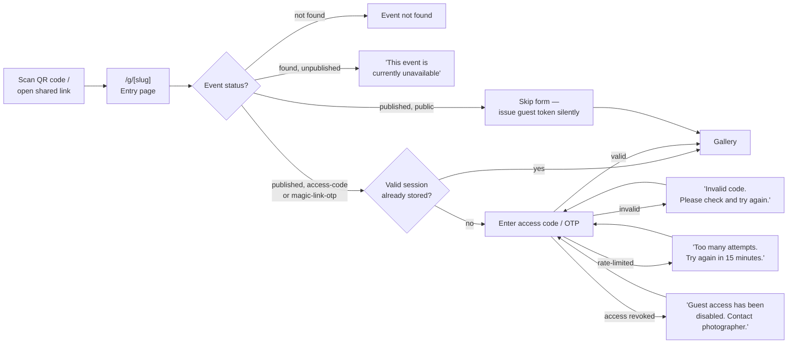

**Design-relevant detail:** the three failure states (`invalid`, `rate-limited`, `revoked`) all render inside the same single-line error slot under the code input — a designer should decide whether these deserve visually distinct treatment (severity, icon, color) rather than three sentences competing for one line.

---

### G2 — Browse gallery, filter, and act on a photo

Source: `app/g/[slug]/gallery/page.tsx`, `components/gallery/*`, `components/photo-actions/*`

The gallery is the guest's home base — everything else (search, favourites, share) branches off it and returns to it.

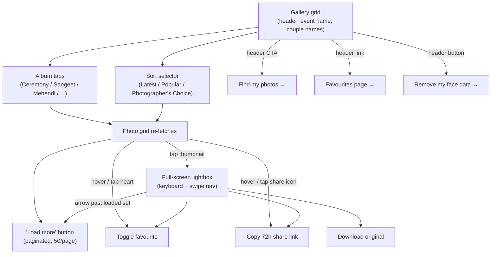

**Design-relevant detail:** favourite/share icons are hover-revealed on desktop but always-visible on mobile (`opacity-100 sm:opacity-0 sm:group-hover:opacity-100`) — worth a deliberate touch-target pass rather than an accident of the breakpoint. Download failures are swallowed silently on every one of these paths (single photo in the lightbox, bulk ZIP from favourites/results) — there is currently no error state to design for here because none exists yet.

---

### G3 — Face search (selfie → results)

Source: `app/g/[slug]/search/page.tsx`, `components/search/*`

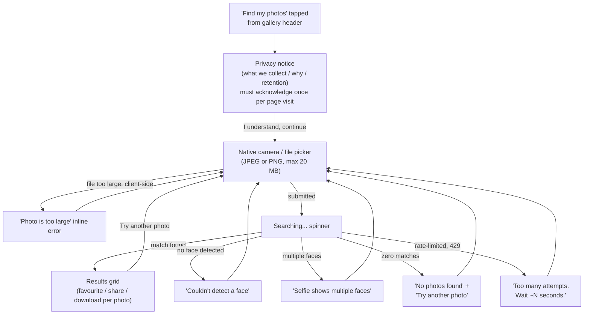

**Design-relevant detail:** the privacy-notice gate is local component state — it resets on every remount, so a guest who leaves for the gallery and comes back re-clicks through the same screen. There is no preview/crop step between picking a photo and firing the search; a bad selfie is only discovered after the full round trip lands on one of the four error states above.

---

### G4 — Favourites

Source: `app/g/[slug]/favourites/page.tsx`, `hooks/useFavourites.ts`

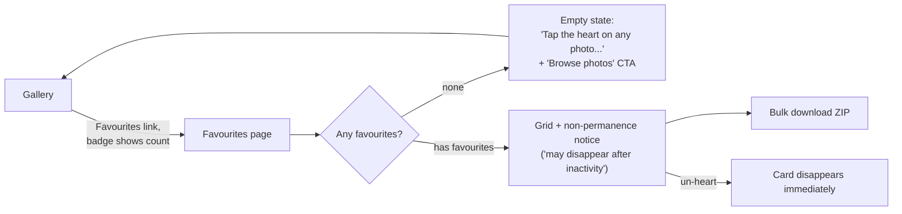

**Design-relevant detail:** favourites are stored server-side in-process with a 24-hour sliding TTL and do not survive a backend restart — the on-page notice is the only signal a guest gets that this list isn't durable. There is no distinct "your favourites expired" state; an expired list looks identical to a never-populated one (both render the same empty state).

---

### G5 — Shared photo link resolution

Source: `app/share/[token]/page.tsx`

A `/share/[token]` link is generated from the share icon and is meant to be opened by anyone the guest forwards it to (WhatsApp, etc.) — so this is the one guest surface that must handle "visitor with zero context."

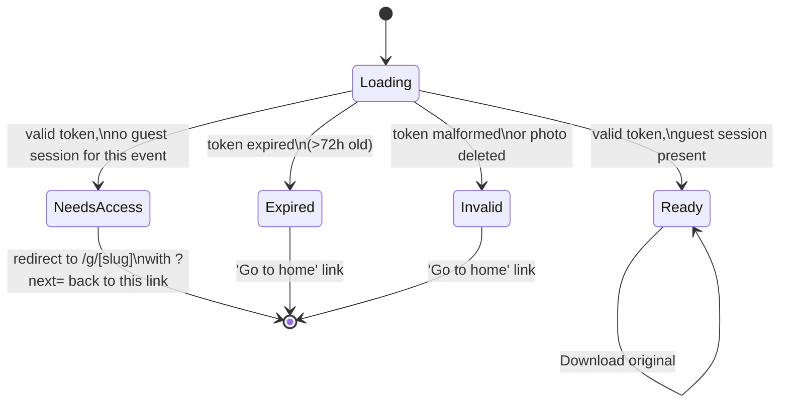

**Design-relevant detail:** three of the four end states (`Expired`, `Invalid`, a `NeedsAccess` visitor with no event slug to redirect to) dead-end at a bare "Go to home" link with no way back to the actual photo — worth deciding whether any of these should instead explain *why* and point somewhere more useful than the marketing root.

---

### G6 — Remove my face data

Source: `app/g/[slug]/gallery/page.tsx` (modal), form fields only

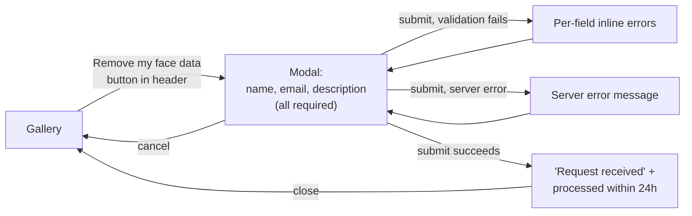

This is the one privacy-compliance-facing flow a guest can trigger directly; it feeds **A3** below on the admin side.

---

## Photographer / event owner workflows

### P1 — Account access

Source: `app/(auth)/login/page.tsx`, `app/(auth)/register/page.tsx`, `components/AuthProvider.tsx`

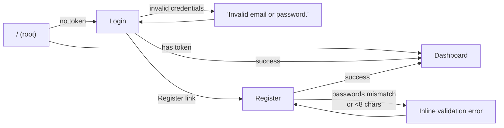

**Design-relevant detail:** there is no visible forgot-password path anywhere in this flow — confirm with product whether that's a real gap or simply out of scope for this pass.

---

### P2 — Dashboard

Source: `app/dashboard/page.tsx`, `components/EventCard.tsx`, `components/AssignedEventCard.tsx`

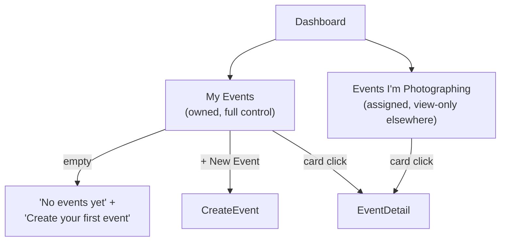

Two independent lists load in parallel (`Promise.allSettled`) and fail independently — an owner with zero owned events but several assigned ones sees only the second section populate, which is correct today but easy to misread as a loading bug if the empty-owned state and the assigned list render at visually similar weight.

---

### P3 — Create event

Source: `app/events/new/page.tsx`, `components/SlugField.tsx`, `lib/slugUtils.ts`

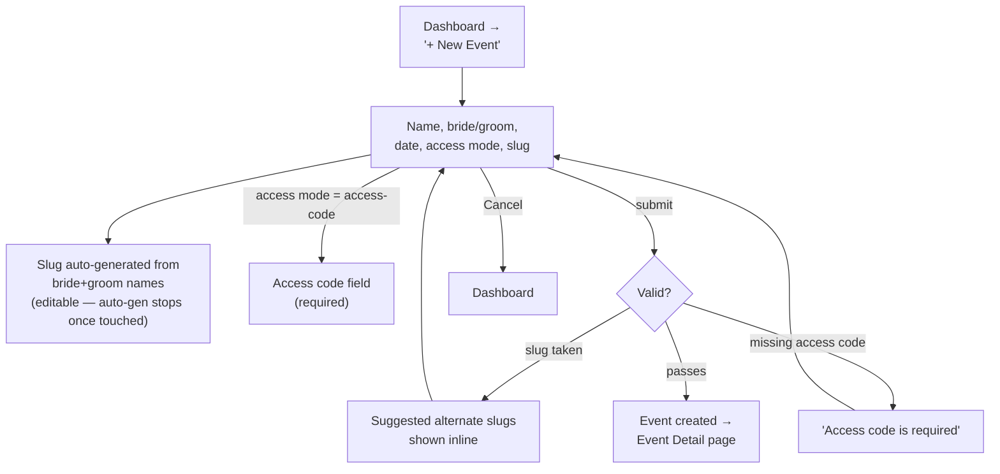

---

### P4 — Event settings hub (tabbed)

Source: `app/events/[eventId]/page.tsx`

The single busiest surface in the product. It was split into four tabs in a recent refactor; an assigned (non-owner) photographer only ever sees the first two, all fields disabled.

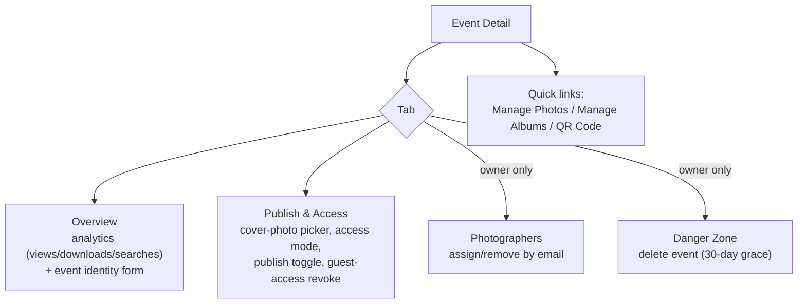

Publish itself is gated by two independent client-side checks that both have to clear before the button is even clickable:

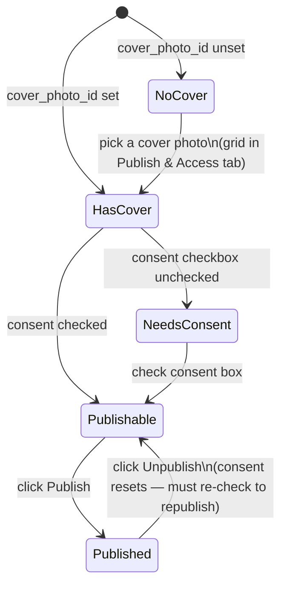

**Design-relevant detail:** the two disabled-button hints ("set a cover photo" / "check the consent box") both surface as the same amber inline box and can show up simultaneously — worth deciding whether a designer wants a single combined checklist state instead of stacked hints.

---

### P5 — Photo upload & processing

Source: `app/events/[eventId]/photos/page.tsx`

The most operationally complex screen: chunked, resumable, deduplicated upload running concurrently with a live server-sent-events processing monitor.

```mermaid
flowchart TD
    Drop["Drag-and-drop or\nclick-to-browse"] --> Queue["Upload queue\n(per-file status dot)"]
    Queue --> Validate{Type + size ok?\n(JPEG/PNG, ≤25MB)}
    Validate -->|no| QueuedErr["Item shown as error,\nnever uploads"]
    Validate -->|yes| Hash["Hash file (dedup check)"]
    Hash --> Initiate["Initiate session"]
    Initiate -->|duplicate hash| Duplicate["Marked 'duplicate',\nskipped"]
    Initiate -->|new or resumable| Chunks["Upload chunks\n(3 files concurrently,\n3 retries per chunk)"]
    Chunks -->|all chunks fail| ChunkErr["Item errored,\nstays in queue for retry"]
    Chunks -->|complete| Done["Item marked done →\nphoto grid refreshes"]
    Done -.SSE progress stream.-> Panel["Processing Status panel:\npending / processing / indexed / failed counts"]
    Panel -->|gallery_ready event| ReadyBanner["'Gallery ready —\nguests can now search!' banner"]
    Panel -->|per-photo failure| RetryBtn["Retry button on\nthat photo's card"]
    RetryBtn --> Chunks
```

**Design-relevant detail:** album assignment and the "Photographer's Choice" star are both one-photo-at-a-time controls on each grid card — for an app whose own architecture doc says "thousands of wedding pictures," this is the single biggest scale mismatch between the UI's interaction model and its stated use case. If the SSE connection drops, the panel goes stale with a silent 60-second fixed-interval reconnect and no "reconnecting…" indicator — currently no distinct visual state exists for that condition.

---

### P6 — Album management

Source: `app/events/[eventId]/albums/page.tsx`, `app/events/[eventId]/albums/[albumId]/page.tsx`, `components/AlbumList.tsx`

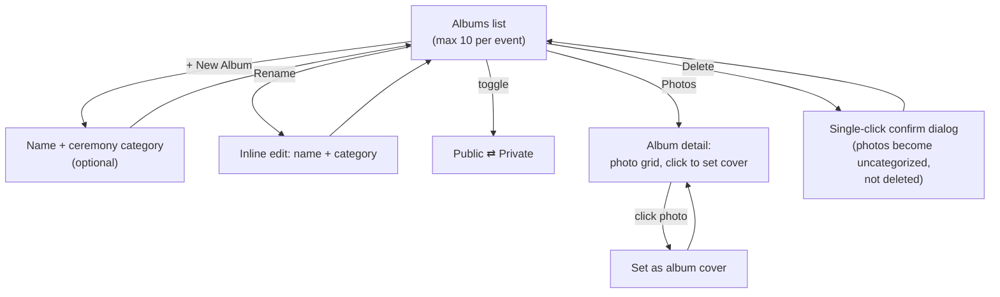

**Design-relevant detail:** deleting an event requires typing `DELETE` to confirm; deleting an album — which can silently un-categorize hundreds of photos — is a single click. A designer weighing confirmation-dialog weight across the product should treat this as the same tier as the event deletion, not a lighter one.

---

### P7 — QR code & guest link

Source: `app/events/[eventId]/qr/page.tsx`

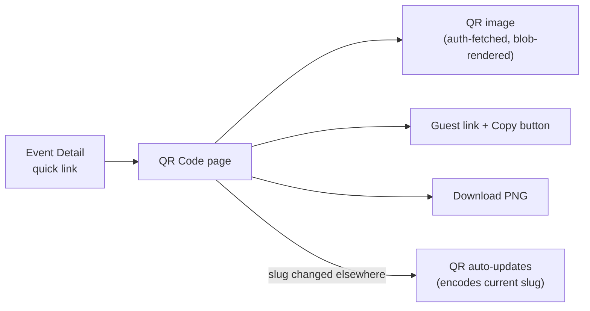

This is the smallest, calmest screen in the owner journey — a single-purpose handoff artifact, worth keeping that way.

---

## Platform admin workflows

### A1 — Platform events oversight

Source: `app/admin/page.tsx`

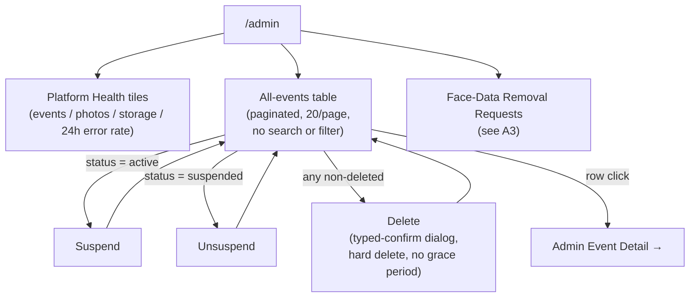

**Design-relevant detail:** admin delete is a hard, immediate, no-grace-period purge — visually it should read as more dangerous than the owner-side delete (which has a 30-day recovery window), not the same or lighter weight.

---

### A2 — Admin event detail (read-only)

Source: `app/admin/events/[eventId]/page.tsx`

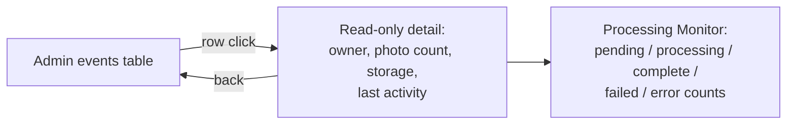

No actions live on this screen at all — suspend/unsuspend/delete only exist back on the list. Confirm with product whether that split is intentional (drill-down = diagnosis, list = action) or an oversight.

---

### A3 — Face-data removal fulfillment

Source: `app/admin/page.tsx` (Removal Requests section)

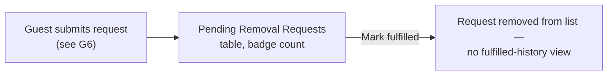

**Design-relevant detail:** once marked fulfilled, a request simply disappears from the UI — there is no audit trail visible anywhere for compliance review. If that history exists only in the database, a designer should know this screen currently can't show it.

---

## Screen inventory

| Screen | Persona | Purpose | Reached from |
|---|---|---|---|
| `/g/[slug]` | Guest | Entry gate — code/OTP or straight through | QR code, shared link |
| `/g/[slug]/gallery` | Guest | Browse, filter, sort, lightbox | Entry page |
| `/g/[slug]/search` | Guest | Consent → selfie → results | Gallery header |
| `/g/[slug]/favourites` | Guest | Saved photos, bulk ZIP | Gallery header |
| `/share/[token]` | Guest | Single shared photo, 72h expiry | External share link |
| `/login`, `/register` | Owner | Auth | Nav, root redirect |
| `/dashboard` | Owner | Owned + assigned events | Nav, post-login |
| `/events/new` | Owner | Create event | Dashboard |
| `/events/[eventId]` | Owner | Settings hub — 4 tabs | Dashboard, breadcrumbs |
| `/events/[eventId]/photos` | Owner | Upload + processing status | Event detail |
| `/events/[eventId]/albums` | Owner | Create/rename/delete/visibility | Event detail |
| `/events/[eventId]/albums/[albumId]` | Owner | Pick album cover | Albums list |
| `/events/[eventId]/qr` | Owner | QR image, guest link, PNG | Event detail |
| `/admin` | Admin | Health, events table, removal queue | Nav (admin only) |
| `/admin/events/[eventId]` | Admin | Read-only drill-down | Admin table |
| `/privacy` | All | Platform privacy notice | Search consent link |

---

## Cross-cutting states worth designing deliberately

These recur across nearly every workflow above and are currently handled ad hoc, screen by screen:

| State | Where it shows up today | Note for design |
|---|---|---|
| Loading | Plain `"Loading..."` text, no skeleton, on most pages | Gallery and Photos pages do have skeleton grids; most other screens don't |
| Empty | Bespoke copy per screen (favourites, albums, photos, admin tables) | No shared empty-state component exists yet |
| Inline field/form error | Red text under the field, consistent styling | The one consistent pattern in the app — good baseline to extend |
| Silent failure | Photo/ZIP downloads only | The one place errors don't surface at all |
| Disabled + hint | Publish button (consent / cover), form fields for non-owners | Hint text appears as a title tooltip *and* an amber inline box — pick one |
| Confirm dialog | Two weights exist: typed `DELETE` vs. single-click confirm | Currently not mapped consistently to the actual risk of the action |
