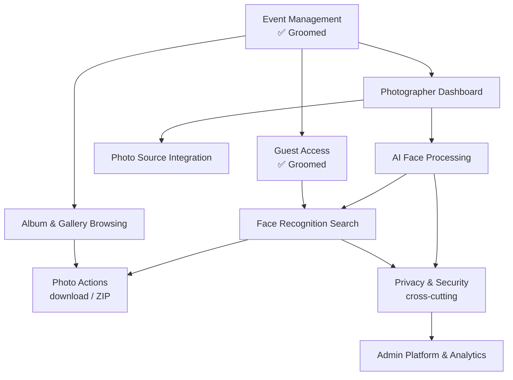

# Epic Prioritisation Plan
Date: 2026-06-19

## Context

Two epics have groomed requirements: **Event Management** (active branch `feature/groom-event-management`) and **Guest Access**. All others are `Draft`. The core product differentiator is face-recognition search — everything else is plumbing to make that work or polish after it works.

## Dependency Map

## Selected Sequence: Option A — End-to-end MVP Slice

Build the minimal vertical that demonstrates the face-search value prop, then layer in browsing and ops.

| # | Epic | Groom status | Why here |
|---|------|-------------|----------|
| 1 | Event Management | ✅ Groomed | Foundation — already groomed |
| 2 | Guest Access | ✅ Groomed | Guest entry — already groomed |
| 3 | Photographer Dashboard | Next | Photos must exist before anything else works |
| 4 | AI Face Processing | Backlog | The engine behind the core differentiator |
| 5 | Face Recognition Search | Backlog | Core value prop — demo-able end-to-end after this |
| 6 | Photo Actions | Backlog | ZIP download completes the guest journey |
| 7 | Album & Gallery Browsing | Backlog | Enhances discovery; not required for face search |
| 8 | Photo Source Integration | Backlog | Extends photographer workflow (Drive/Photos) |
| 9 | Privacy & Security | Backlog | Formal compliance layer on top of already-baked constraints |
| 10 | Admin Platform & Analytics | Backlog | Ops tooling — lowest guest value, last priority |

## Notes

- Privacy & Security features (selfie auto-delete, embedding encryption) must be built into epics 3–5 as constraints, not deferred entirely. The Privacy & Security epic covers the formal compliance surface (consent flows, GDPR deletion requests).
- Option B (photographer-pipeline first) and Option C (traditional gallery first) were considered and rejected in favour of the fastest path to validating the core face-search differentiator.
